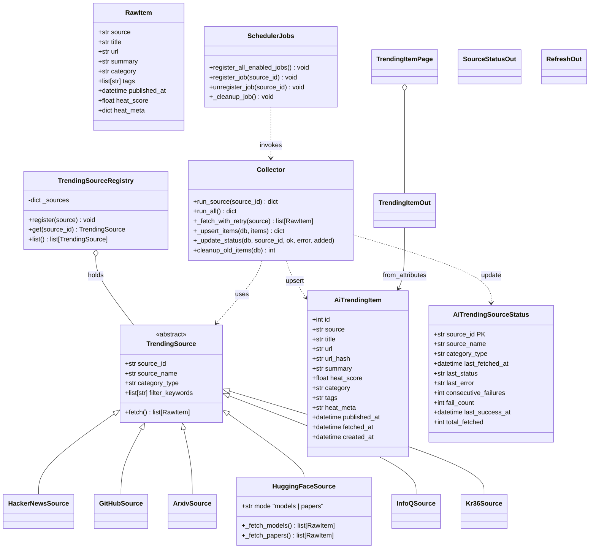
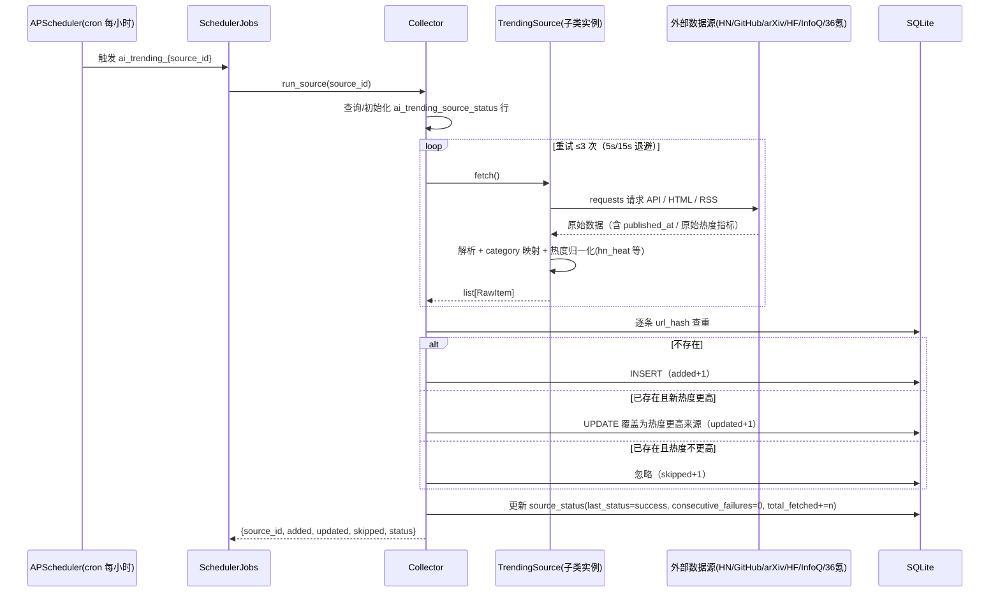
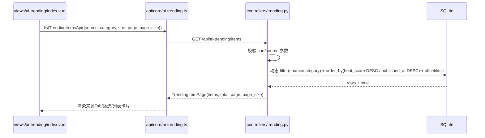
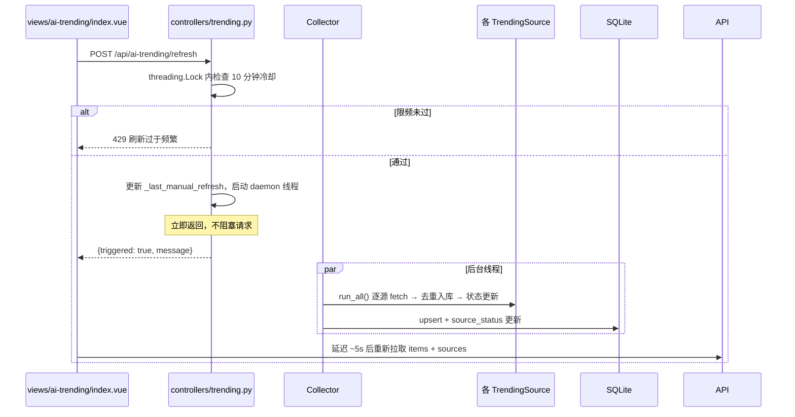
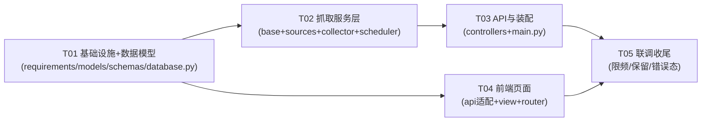

# AI 开发热点聚合 — 系统架构设计与任务分解

| 项目信息 | 内容 |
|---|---|
| 模块 | `ai_trending`（后端 `backend/app/ai_trending/`，前端 `frontend/apps/web-antd/src/views/ai-trending/`） |
| 技术栈 | FastAPI + SQLAlchemy 2.0 + APScheduler（后端）；Vue3 + Vben Admin（web-antd）+ ant-design-vue（前端） |
| 数据库 | SQLite（沿用 `app/core/database.py` 的 `Base`/`SessionLocal`/`init_db` 机制） |
| 上游输入 | `doc/AI_TRENDING_PRD.md`（产品经理许清楚产出）+ 已拍板的 4 个决策 |
| 基线 | `feature/ai-trending` 分支（已含 resource / stock / xhs 等既有模块） |

---

## Part A：系统设计

### 1. 实现方案与框架选型

#### 1.1 核心难点分析

| 难点 | 风险点 | 对策 |
|---|---|---|
| 6 个异构数据源（JSON API / HTML / Atom / RSS 2.0） | 接口格式差异大，代码易散乱 | 抓取器抽象基类 + 源注册表（完全复用 resource 模块的 `ResourceSource`/`registry` 模式），每个源一个类、内部自包含解析逻辑 |
| GitHub Trending 无官方 API | SSR HTML 解析可能失败 | 主通道 SSR HTML（`lxml` 解析），失败后降级 GitHub Search API（`search/repositories?q=created:>{date}&sort=stars`） |
| 跨源同 URL 去重（如 HN 引用 arXiv 链接） | 重复条目污染列表 | `url_hash`（归一化 URL 的 MD5）唯一约束 + INSERT OR IGNORE；已存在且新热度更高时 upsert 覆盖，保留热度最高来源 |
| 跨源热度不可比 | 各源量纲不同（points / stars / trendingScore / 无热度） | 统一「对数缩放 → 归一化到 0-100 → 24h 时间衰减」管线，函数集中在 `base.py`，可单测 |
| 中文源噪声（36氪全站 RSS） | 非 AI 商业新闻混入 | 共享 AI 关键词过滤器（标题+摘要命中即保留），36氪默认开启、InfoQ 提供开关 |
| 定时任务稳定性 | 单源失败拖垮整体 | 每源独立 job（APScheduler cron），失败重试 2 次（5s/15s），连续失败 ≥3 标记 failed，互不阻塞 |

#### 1.2 框架选型（与现有模块完全一致）

| 能力 | 选型 | 理由 |
|---|---|---|
| HTTP 客户端 | `requests`（已有） | 既有模块全部使用，无需新增 |
| RSS/Atom 解析 | **新增 `feedparser>=6.0`** | InfoQ / 36氪（RSS 2.0）与 arXiv（Atom）统一解析；标准库 `xml.etree` 对异常 feed 健壮性差 |
| HTML 解析 | `lxml`（已有，yfinance 引入） | GitHub Trending SSR HTML 用 lxml XPath 提取；**不新增 beautifulsoup4**，控制依赖 |
| 定时任务 | `apscheduler`（已有，`app/core/scheduler.py` 单例） | 沿用 `get_scheduler()` + `register_all_enabled_jobs()` 生命周期模式 |
| ORM | `sqlalchemy>=2.0`（已有，`Mapped`/`mapped_column` 风格） | 与 resource/xhs 模型一致 |
| 重试 | 手动重试循环（不依赖 `retry` 包） | 需精确控制 5s/15s 退避 + 状态记录，手写 3 行循环更清晰 |
| 前端 | Vue3 + ant-design-vue + lucide-vue-next + `@vben/common-ui` Page | 与 resource 页面完全同风格（暗色卡片 `rounded-xl border-slate-700/50 bg-slate-900/60`） |
| 限频 | 进程内内存锁 + 时间戳（无 Redis） | 当前单进程部署（进程内 BackgroundScheduler），与调度器单例哲学一致 |

#### 1.3 架构模式

- **后端**：四层结构 `controllers / models / schemas / services`，与 resource/xhs 模块一致；services 内采用「抽象基类 + 注册表 + 统一 Collector 执行器」策略模式（对齐 `ResourceSource` + `registry`）。
- **前端**：页面组件 + API 适配层（`#/api/core/ai-trending.ts`，namespace 类型声明 + requestClient 函数），路由注册独立文件。
- **数据流**：定时/手动触发 → 各源 fetch() → RawItem 列表 → Collector 统一去重/热度处理/入库 → REST API 只读查询。

---

### 2. 文件列表

#### 后端（新建 19 + 修改 3）

```
backend/
├── requirements.txt                                    [修改] 新增 feedparser>=6.0
├── app/
│   ├── core/
│   │   └── database.py                                 [修改] init_db() 注册 ai_trending models
│   ├── main.py                                         [修改] include_router + lifespan 挂载调度
│   └── ai_trending/                                    [新建模块]
│       ├── __init__.py
│       ├── models/
│       │   ├── __init__.py                             # 导出 AiTrendingItem / AiTrendingSourceStatus
│       │   ├── ai_trending_item.py                     # 热点条目 ORM（含索引）
│       │   └── source_status.py                        # 来源健康状态 ORM
│       ├── schemas/
│       │   ├── __init__.py
│       │   └── trending.py                             # Pydantic 出入参（RawItem 除外，RawItem 放 services/base.py）
│       ├── services/
│       │   ├── __init__.py
│       │   ├── base.py                                 # 抓取器抽象基类 + RawItem + 热度归一化 + URL 归一化 + AI 关键词过滤
│       │   ├── collector.py                            # 统一执行：抓取→重试→去重→upsert→状态更新→保留策略
│       │   ├── scheduler_jobs.py                       # APScheduler job 注册/注销 + 每日清理 job
│       │   └── sources/
│       │       ├── __init__.py                         # 注册表实例化：注册 7 个源实例
│       │       ├── hn.py                               # Hacker News（Algolia API）
│       │       ├── github.py                           # GitHub Trending（SSR HTML + Search API 兜底）
│       │       ├── arxiv.py                            # arXiv（Atom feed，cs.AI OR cs.LG）
│       │       ├── hf.py                               # Hugging Face（models / daily_papers 双模式）
│       │       ├── infoq.py                            # InfoQ 中国（RSS）
│       │       └── kr36.py                             # 36氪（RSS + AI 关键词过滤）
│       └── controllers/
│           ├── __init__.py
│           └── trending.py                             # /api/ai-trending/* 路由（3 个端点）
```

#### 前端（新建 3）

```
frontend/apps/web-antd/src/
├── api/core/ai-trending.ts            # API 适配层（namespace AiTrendingApi + 3 个请求函数）
├── views/ai-trending/index.vue        # 热榜页（Tab/筛选/排序/列表/详情弹窗/刷新/状态）
└── router/routes/modules/ai-trending.ts  # 路由注册（参考 resource.ts）
```

---

### 3. 数据结构与接口

#### 3.1 数据库表设计

**表 `ai_trending_items`**（热点条目）：

| 字段 | 类型 | 约束/索引 | 说明 |
|---|---|---|---|
| id | int | PK | 主键 |
| source | str(32) | index | 来源标识：`hn / github / arxiv / hf_models / hf_papers / infoq / kr36` |
| title | str(512) | | 标题 |
| url | str(1024) | | 原文链接 |
| url_hash | str(64) | **unique** | 归一化 URL 的 MD5，去重键 |
| summary | Text | | 摘要（RSS description / arXiv abstract / HF 摘要） |
| heat_score | float | **index** | 热度分 0-100，列表默认排序键 |
| category | str(16) | index | `news / project / paper / model` |
| tags | str(255) | | JSON 数组（语言、框架、arXiv 分类等） |
| heat_meta | Text | | JSON 字典（原始指标：points / stars_today / trendingScore），UI 展示「HN 123 points / ★today 456」用；**PRD 草案之外补充字段** |
| published_at | DateTime | | 原文发布时间（缺失用抓取时间兜底） |
| fetched_at | DateTime | | 抓取时间 |
| created_at | DateTime | | 入库时间 |

索引设计（与 PRD 补充一致）：
- `url_hash` 唯一索引（去重键）
- `source + published_at` 联合索引（来源筛选 + 时间排序高频路径）
- `heat_score` 单列索引（默认热度排序）
- `category` 单列索引（类型筛选）
- `source` 单列索引（来源 Tab 筛选）

**表 `ai_trending_source_status`**（来源健康状态，供 `/sources` 端点与 UI 警示；PRD 草案之外补充）：

| 字段 | 类型 | 约束 | 说明 |
|---|---|---|---|
| source_id | str(32) | PK | hn / github / arxiv / hf_models / hf_papers / infoq / kr36 |
| source_name | str(64) | | 展示名（Hacker News / GitHub Trending / arXiv / HF 模型榜 / HF 每日论文 / InfoQ / 36氪） |
| category_type | str(16) | | 该源产出条目的默认类型 |
| last_fetched_at | DateTime | | 最近一次抓取尝试时间 |
| last_status | str(16) | | success / failed |
| last_error | Text | | 最近一次失败原因（截断 500 字） |
| consecutive_failures | int | | 连续失败次数（成功清零） |
| fail_count | int | | 累计最终失败次数（UI 警示用，不自动清零） |
| last_success_at | DateTime | | 最近一次成功时间 |
| total_fetched | int | | 累计抓取条目数（成功时累加） |

#### 3.2 类图

`services/base.py` 中 `RawItem`（Pydantic）与 `TrendingSource`（ABC）；`services/sources/*.py` 6 个抓取器类（HF 类按 `mode` 实例化两次，注册为 `hf_models` / `hf_papers` 两个源）；`services/collector.py` Collector；`services/scheduler_jobs.py` SchedulerJobs；models/schemas 各 ORM/Pydantic 类。



#### 3.3 热度归一化（具体实现签名与参数）

全部集中在 `services/base.py`，可单测、无 IO：

```python
# ---- 常量 ----
MAX_REF = {
    "hn": 10_000,          # HN points 参考上限（log2 基准）
    "github": 5_000,       # GitHub stars_today 参考上限
    "hf_models": 1_000_000,  # HF trendingScore 参考上限（log10 基准）
}
PAPER_RSS_BASE = 10.0     # arXiv/HF papers/RSS 时间衰减默认分上限
DECAY_HALF_LIFE_HOURS = 24.0  # 统一时间衰减半衰期

# ---- 基础函数 ----
def log2(x: float) -> float
def log10(x: float) -> float
def hours_since(dt: datetime | None, now: datetime | None = None) -> float
    """距发布时间小时数；dt 缺失时返回 0（抓取时间兜底）。"""
def time_decay_factor(published_at: datetime | None, now: datetime | None = None) -> float
    """0.5 ** (hours_since(published_at) / 24)，输出 (0, 1]。"""
def normalize_heat(raw: float, max_ref: float) -> float
    """clamp(raw / max_ref * 100, 0, 100)。"""
def final_heat(base_score: float, published_at: datetime | None, now: datetime | None = None) -> float
    """round(base_score * time_decay_factor(...), 2)，统一收尾。"""

# ---- 各源热度（源类在 fetch() 内调用） ----
def hn_heat(points: int, published_at: datetime | None, now: datetime | None = None) -> float
    """base = normalize_heat(log2(points + 1), log2(10_001))，再乘时间衰减。"""
def github_heat(stars_today: int, published_at: datetime | None, now: datetime | None = None) -> float
    """base = normalize_heat(log2(stars_today + 1), log2(5_001))，再乘时间衰减。"""
def paper_heat(published_at: datetime | None, now: datetime | None = None) -> float
    """arXiv / HF papers / RSS 共用：base = normalize_heat(max(0, 10 - hours/6), 10)，再乘时间衰减。"""
def hf_models_heat(trending_score: float, published_at: datetime | None, now: datetime | None = None) -> float
    """base = normalize_heat(log10(trending_score + 1), log10(1_000_001))，再乘时间衰减。"""
```

> 说明：PRD 公式「arXiv/HF papers 时间衰减默认分 `max(0, 10 - 距发布小时数/6)`」作为 base，再按 PRD 统一乘 `0.5^(小时数/24)` 时间衰减，最终输出 0-100。热度在**入库时一次性算好落库**（`heat_score` 列），列表接口直接按列排序，不做每请求实时重算，保持查询轻量。

#### 3.4 URL 归一化与去重

```python
def normalize_url(url: str) -> str:
    """规则：
    1. strip 空白
    2. scheme + host 转小写
    3. 去掉末尾 '/'（根路径除外）
    4. 丢弃查询参数中 DROP_QUERY_PARAMS = {'utm_source','utm_medium','utm_campaign','ref','source','from','mc_cid','mc_eid'} 及所有 utm_* 前缀参数
    5. arXiv 特例：arxiv.org/abs/XXXX.XXXXXvN → 去版本号 → arxiv.org/abs/XXXX.XXXXX
    6. HF 特例：huggingface.co 链接统一为 https://huggingface.co/{model_id}（去 /blob/、/tree/ 等后缀）
    """
def url_hash(url: str) -> str:
    """hashlib.md5(normalize_url(url).encode('utf-8')).hexdigest()"""
def filter_ai_keywords(title: str, summary: str = "", keywords: list[str] | None = None) -> bool:
    """大小写不敏感子串匹配（标题+摘要），命中任一关键词返回 True。
    默认 AI_KEYWORDS = [人工智能, AI, 大模型, OpenAI, LLM, 机器学习, 深度学习, 智能体, AGI,
                       AIGC, 生成式, GPT, Claude, Gemini, 开源, 程序员, 编程, 开发者, 技术]（36氪默认使用）"""
```

去重/合并策略（Collector `_upsert_items`，单条 SQL 事务）：
1. 对每条 RawItem 计算 `url_hash`；
2. `SELECT` 查重：不存在 → `INSERT`（added+1）；
3. 已存在且新 `heat_score >` 存量 → **upsert 覆盖**：`source/title/url/summary/heat_score/category/tags/heat_meta/published_at` 更新为新条目（保留热度最高来源），`fetched_at` 更新（updated+1）；
4. 已存在且新热度 ≤ 存量 → 忽略（skipped+1）。

#### 3.5 定时任务（APScheduler）

`services/scheduler_jobs.py`（job id 前缀 `ai_trending_`，全部 `replace_existing=True`）：

| job id | cron | 说明 |
|---|---|---|
| `ai_trending_hn` | `minute=0` | 每小时 |
| `ai_trending_github` | `hour=2,14`, `minute=0` | 每日 2 次（GitHub 每日更新） |
| `ai_trending_arxiv` | `minute=0` | 每小时 |
| `ai_trending_hf_models` | `minute=0` | 每小时 |
| `ai_trending_hf_papers` | `minute=0` | 每小时 |
| `ai_trending_infoq` | `minute=0` | 每小时 |
| `ai_trending_kr36` | `minute=0` | 每小时 |
| `ai_trending_cleanup` | `hour=3, minute=30` | 每日保留策略：删 >7 天，再删至 ≤2000 条 |

- 注册入口：`register_all_enabled_jobs()`，在 `main.py` lifespan 中调用（紧邻 `xhs_tracking.register_all_enabled_jobs()`）。
- 失败重试：`_fetch_with_retry` 最多 3 次尝试（初始 + 2 次重试，`sleep(5)` / `sleep(15)`）；最终失败 → `last_status=failed`、`consecutive_failures += 1`，`consecutive_failures >= 3` 时 `fail_count += 1`；成功 → `consecutive_failures=0`、`last_status=success`、`last_success_at=now`。
- 每源 job 独立，任一源失败不阻塞其他源（天然隔离）。

#### 3.6 API 设计（对齐 resource 控制器风格）

```
GET  /api/ai-trending/items?source=&category=&sort=heat|time&page=1&page_size=20
     → { items: TrendingItemOut[], total, page, page_size }
     # source: '' | hn | github | arxiv | hf_models | hf_papers | hf(别名=IN(hf_models,hf_papers)) | infoq | kr36
     # sort: heat(默认, heat_score DESC, id DESC) | time(published_at DESC, id DESC)

GET  /api/ai-trending/sources
     → SourceStatusOut[]
     # [{ source_id, source_name, category_type, last_fetched_at, last_status,
     #    last_error, consecutive_failures, fail_count, last_success_at, total_fetched }]

POST /api/ai-trending/refresh          # 手动刷新，10 分钟限频 1 次
     → { triggered: true, message }    # 限频未过 → 429 { detail: "刷新过于频繁，请 X 秒后重试" }
```

- 全部 `Depends(get_current_user)`（`app/core/deps.py`）。
- `POST /refresh`：校验限频（模块级 `_last_manual_refresh` + `threading.Lock`，10 分钟冷却）→ **异步** `threading.Thread(target=collector.run_all, daemon=True).start()` → 立即返回 `{triggered: true}`。前端触发后延迟 ~5s 重新拉取列表并刷新来源状态。
- 错误语义对齐 resource：400 参数错误 / 404 不存在 / 429 限频 / 502 上游抓取失败。

---

### 4. 程序调用流程

#### 4.1 定时任务触发 → 各源抓取 → 去重入库



#### 4.2 前端查询列表



#### 4.3 手动刷新（限频 + 异步）



---

### 5. 待明确事项（假设已拍板）

| # | 事项 | 本设计采用的假设 |
|---|---|---|
| 1 | 手动刷新同步 vs 异步 | **异步**：全源串行抓取约 10-30s，同步会拖垮请求；返回 `triggered` 后前端轮询 |
| 2 | InfoQ 是否做 AI 关键词过滤 | **默认不过滤**（P0 源、AI 内容浓度高），`filter_keywords` 提供开关，噪声大时一行配置开启 |
| 3 | GitHub Search API 兜底鉴权 | 无 token 匿名调用（限额 10 次/分，仅降级用，够用）；如后续频繁降级可配 token |
| 4 | 热度是否需要查询时实时衰减 | **不需要**：入库时算好存 `heat_score`，避免每请求计算；如需更实时可后续在 SQL 中乘衰减因子 |
| 5 | 抓取执行是否记入统一 `tasks` 表 | **P1 可选**：建议仿 xhs_tracking 记 `module='ai_trending'` 任务，复用任务中心；首版不做 |
| 6 | 多进程部署时的内存限频 | 当前单进程部署成立；如后续多进程需换 Redis，设计上已把限频封装在独立函数便于替换 |
| 7 | 机器之心 | 按决策 **P1 暂缓**，后续申请免费 RSS 后新增一个源类即可（注册一行） |

---

## Part B：任务分解

### 6. 依赖包清单

**后端新增**：
```
feedparser>=6.0: RSS 2.0 / Atom 统一解析（InfoQ / 36氪 / arXiv）
```

**后端已有（复用，不新增）**：`requests`（HTTP）、`lxml`（GitHub HTML 解析，yfinance 已引入）、`loguru`（日志）、`apscheduler>=3.10`、`sqlalchemy>=2.0`、`fastapi>=0.110`、`pydantic-settings`。
> 注意：`requirements.txt` 中**没有** feedparser / beautifulsoup4；HTML 解析用已有 lxml，避免引入 bs4。

**前端**：无需新增（`ant-design-vue` / `lucide-vue-next` / `@vben/common-ui` 均已存在）。

### 7. 任务列表（按依赖顺序，共 5 个）

| 任务 | 名称 | 源文件 | 依赖 | 优先级 |
|---|---|---|---|---|
| **T01** | 项目基础设施：依赖 + 模块骨架 + 数据表 + schemas | `backend/requirements.txt`、`backend/app/core/database.py`（改）、`backend/app/ai_trending/__init__.py`、`models/__init__.py`、`models/ai_trending_item.py`、`models/source_status.py`、`schemas/__init__.py`、`schemas/trending.py` | 无 | P0 |
| **T02** | 抓取服务层：基类 + 6 源实现 + Collector + 调度 | `backend/app/ai_trending/services/__init__.py`、`services/base.py`、`services/sources/__init__.py`、`services/sources/{hn,github,arxiv,hf,infoq,kr36}.py`、`services/collector.py`、`services/scheduler_jobs.py` | T01 | P0 |
| **T03** | API 与装配：控制器 + main.py 路由/生命周期注册 | `backend/app/ai_trending/controllers/__init__.py`、`controllers/trending.py`、`backend/app/main.py`（改） | T02 | P0 |
| **T04** | 前端：API 适配层 + 热榜页 + 路由注册 | `frontend/apps/web-antd/src/api/core/ai-trending.ts`、`views/ai-trending/index.vue`、`router/routes/modules/ai-trending.ts` | T01（API 契约，可与 T02/T03 并行） | P0 |
| **T05** | 端到端联调与收尾：限频/保留/健康状态/错误态打磨 | 修改 `backend/app/ai_trending/controllers/trending.py`、`services/scheduler_jobs.py`、`frontend/apps/web-antd/src/views/ai-trending/index.vue` | T03、T04 | P1 |

**T01 说明**：建表（`ai_trending_items` 含 url_hash 唯一索引、source+published_at 联合索引、heat_score 索引、category 索引；`ai_trending_source_status`）、Pydantic schemas（TrendingItemOut/TrendingItemPage/SourceStatusOut/RefreshOut）、`requirements.txt` 加 feedparser、`database.py` 的 `init_db()` 注册 `app.ai_trending.models`。
**T02 说明**：`base.py` 提供 TrendingSource 抽象类、RawItem、热度归一化 5 函数、URL 归一化/url_hash、AI 关键词过滤；6 个源文件各自实现 `fetch()`（GitHub 含 HTML 主通道 + Search API 兜底；HF 一个类两种 mode）；`sources/__init__.py` 实例化注册表（7 个实例）；`collector.py` 实现重试/去重/upsert/状态/保留策略；`scheduler_jobs.py` 实现 8 个 cron job 注册。
**T03 说明**：3 个端点（items/sources/refresh），refresh 含 10 分钟内存限频 + 异步线程；main.py include_router + lifespan 调 `register_all_enabled_jobs()`。
**T04 说明**：按 resource.ts 风格写 namespace + 3 个函数；页面含来源 Tab（全部/HN/GitHub/arXiv/HF/InfoQ/36氪）、类型 Segmented、排序 Segmented、列表卡片、详情 Modal（跳转原文新窗口）、手动刷新按钮、Skeleton/Empty/Alert 三态；路由 `/ai-trending`。
**T05 说明**：验证限频 429、保留策略（7 天/2000 条）、来源失败警示、前端错误态；修复联调发现的问题。

### 8. 共享知识（跨文件约定）

- **日志**：统一 `from loguru import logger`；正常 `logger.info`、警告 `logger.warning`、异常 `logger.exception`（带堆栈）。
- **时间**：一律 `datetime.now(timezone.utc)`（与现有模型一致）；DateTime 列存 aware 时间；对外 API 序列化用 `isoformat()`。
- **URL 归一化规则**：见 3.4（小写 scheme/host、去尾斜杠、去 utm_*/ref/source 等参数、arXiv 去版本号、HF 归一化 id）。
- **category 枚举**：`news / project / paper / model`；各源默认映射：hn→news、github→project、arxiv→paper、hf_models→model、hf_papers→paper、infoq→news、kr36→news。
- **source_id 枚举**：`hn / github / arxiv / hf_models / hf_papers / infoq / kr36`（HF 前端 Tab 合并展示，后端用 `hf` 别名查询两个子源）。
- **tags / heat_meta**：JSON 字符串存储，`json.dumps(..., ensure_ascii=False)` 序列化；读取 `json.loads`。
- **依赖注入**：`db: Session = Depends(get_db)`、`_=Depends(get_current_user)`；controller 只做参数校验与编排，不写业务逻辑。
- **HTTP 错误语义**：400 参数错 / 404 不存在 / 429 限频 / 502 上游抓取失败（对齐 resource controller）。
- **新增数据源三步**：① `services/sources/xx.py` 实现 TrendingSource 子类（source_id/source_name/category_type + fetch()）；② `services/sources/__init__.py` 注册一行；③ `services/scheduler_jobs.py` 加 cron job 配置一行。前端 Tab 与 `/sources` 自动出现，无需改 controller。
- **SQLite 并发**：抓取 job 运行在调度器线程，通过 `SessionLocal()` 自开自关（参考 xhs `run_scan`），不要跨线程共享 Session。

### 9. 任务依赖图



---

## 附：设计对齐检查

- 与 PRD 决策一致：默认热度排序（跨源归一化 + 24h 衰减）、点击先弹详情弹窗、中文源 InfoQ(P0)+36氪(P1 关键词过滤)、保留 7 天/2000 条。
- 与现有代码风格一致：四层模块结构、`Mapped/mapped_column` ORM、`register_all_enabled_jobs()` lifespan 注册、`APIRouter(prefix=...)` + `Depends(get_current_user)`、前端 namespace API + `#/views` + 暗色卡片样式。
- 依赖最小化：仅新增 `feedparser` 一个后端依赖。
