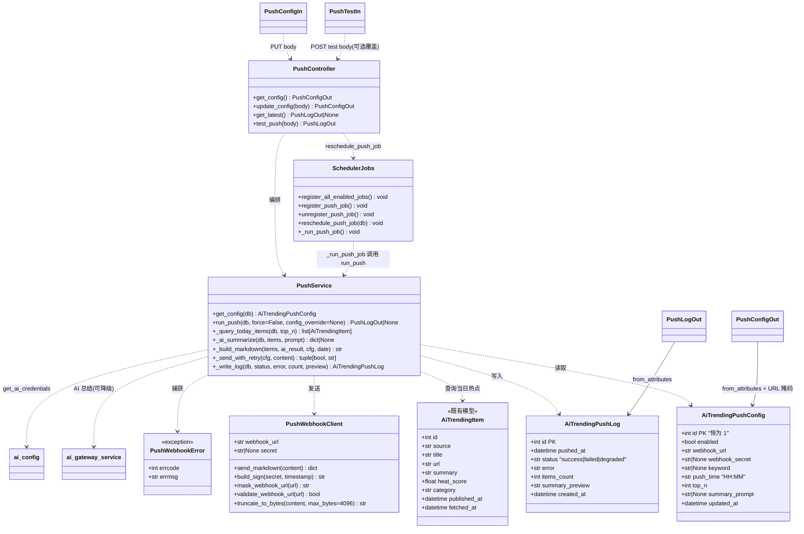
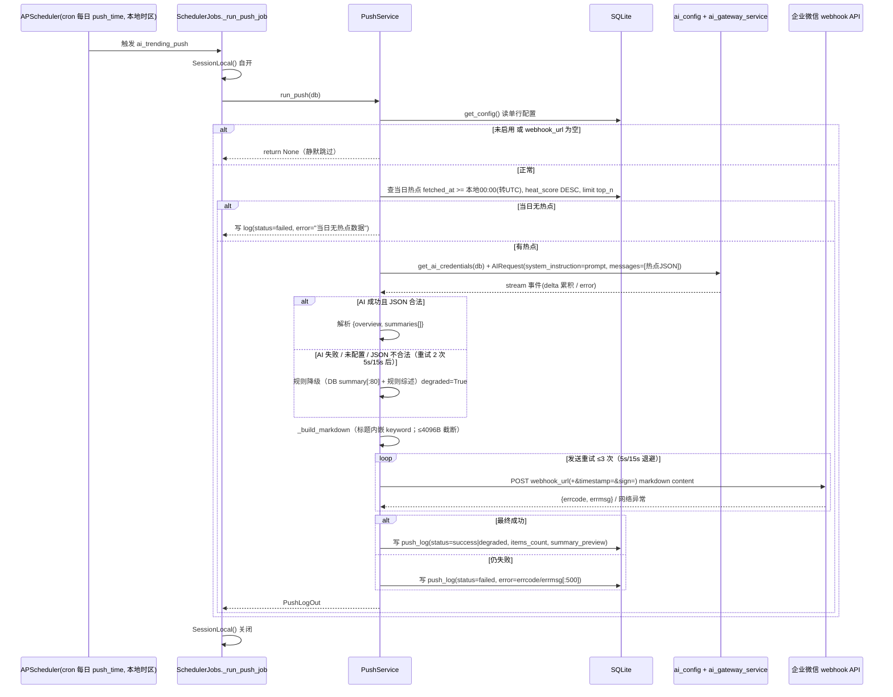
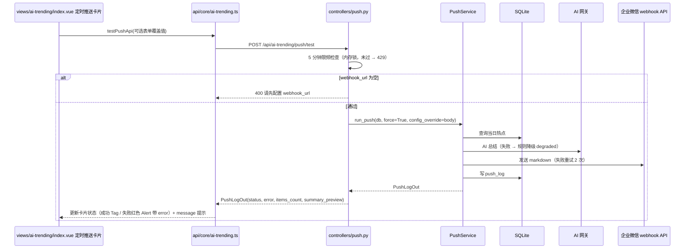
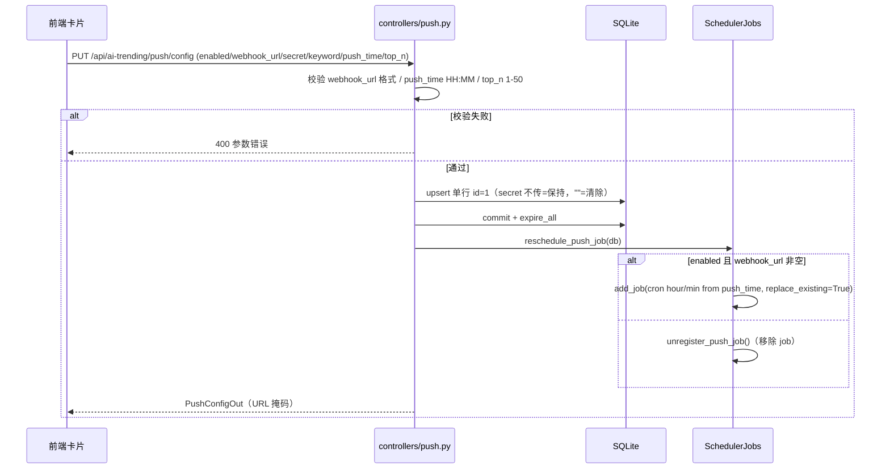
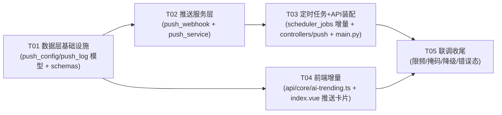

# AI 开发热点聚合 — 增量架构设计：AI 热点定时推送

| 项目信息 | 内容 |
|---|---|
| 模块 | `ai_trending` 内增量（新增 `ai_trending_push_config` / `ai_trending_push_log` 两表，路由 `/api/ai-trending/push/*`） |
| 技术栈 | FastAPI + SQLAlchemy 2.0 + APScheduler（后端）；Vue3 + Vben Admin（web-antd）+ ant-design-vue（前端）；SQLite |
| 上游输入 | `doc/AI_TRENDING_PUSH_PRD.md`（增量 PRD）+ 主理人已拍板的 6 项 Open Questions 决策 |
| 基线 | `feature/ai-trending` 分支（已上线：6 来源 7 通道、217 条热点、每小时抓取 + 每日清理、/api/ai-trending/items\|sources\|refresh） |
| 既有约定 | 以 `doc/AI_TRENDING_ARCHITECTURE.md` 为准，本设计只描述增量，不重复既有架构 |

---

## Part A：系统设计

### 1. 实现方案与框架选型

#### 1.1 核心难点分析

| 难点 | 风险点 | 对策 |
|---|---|---|
| 企微机器人 webhook 协议细节（markdown 类型、加签、关键词、错误码） | 协议不熟导致推送失败且难排查 | 独立 `push_webhook.py` 客户端封装：单次发送 + errcode 解析（0 成功 / 93000 无效 webhook 或关键词不匹配 / 93004 频繁），加签用标准库 `hmac/hashlib/base64`，全部可单测 |
| markdown content 上限 4096 字节 | 长标题/长摘要超限被企微拒绝 | 统一的字节级截断管线：先截摘要（60 字）→ 再减条数（不低于 top_n 的 50%）→ 最后截综述/硬切，保证消息一定能发出去 |
| AI 总结失败不应阻断推送 | 推送日报是核心价值，AI 是增强 | AI 失败/未配置 → 规则降级（用库内 `summary` 截断 80 字 + 链接 + 规则综述），log 标记 `degraded`；webhook 通道与 AI 通道解耦 |
| AI 输出不可信（幻觉 URL / 乱格式） | 群内链接点不开 | **AI 只生成摘要与综述（JSON），原文 URL 一律由服务端从 DB 拼装**，从根上保证「点击可达率 ≥95%」 |
| 当天热点口径 + 时区 | fetched_at 存 UTC，push_time 按本地时区，口径不一致会查错数据 | 统一约定：库内一律 UTC；「当天 00:00」= 服务器本地午夜换算成 UTC 再查询；`push_time` 由 APScheduler 按服务器本地时区触发（与既有 cron 一致） |
| 定时任务重调度 | 用户改 push_time / 开关后 job 不生效 | `register_push_job()` 统一入口（读配置 → 注册/移除 cron，`replace_existing=True` 幂等）；PUT 保存后显式 `reschedule_push_job(db)`；重启由 `register_all_enabled_jobs()` 兜底 |

#### 1.2 框架选型（**不引入任何新依赖**，沿用现有约定）

| 能力 | 选型 | 理由 |
|---|---|---|
| HTTP 客户端 | `requests`（已有） | 既有模块全部使用；企微 webhook 就是一次 POST + JSON，无需新依赖 |
| 加签签名 | `hmac` / `hashlib` / `base64`（标准库） | 企微加签规范：`sign = base64(hmac_sha256(secret, f"{timestamp}\n{secret}"))` |
| 定时任务 | `apscheduler`（已有，`app/core/scheduler.py` 单例） | 沿用 `register_all_enabled_jobs()` 生命周期 + `replace_existing=True` 幂等模式 |
| ORM | `sqlalchemy>=2.0`（已有，`Mapped`/`mapped_column` 风格） | 与 `ai_trending_item.py` / `source_status.py` 完全一致 |
| AI 网关 | `ai_config.get_ai_credentials()` + `ai_gateway_service.stream()`（已有） | 复用当前选中 provider 的 Key/模型，不硬编码厂商（与 xhs/stock 调用模式一致） |
| 重试 | 手动重试循环（不依赖 retry 包） | 需精确控制 5s/15s 退避 + 状态记录，与 `collector._fetch_with_retry` 同风格 |
| 限频 | 进程内内存锁 + 时间戳（无 Redis） | 测试推送限频 5 分钟 1 次，与 `/refresh` 限频完全同模式 |
| 前端 | Vue3 + ant-design-vue + `@vben/common-ui` | 卡片样式沿用热榜页暗色风格（`rounded-xl border-slate-700/50 bg-slate-900/60`） |

#### 1.3 架构模式

- **后端**：沿用四层结构 `controllers / models / schemas / services`；推送编排逻辑全部在 `services/push_service.py`，企微协议细节在 `services/push_webhook.py`，控制器只做校验与编排（与 `controllers/trending.py` 同风格）。
- **数据流**：`cron/手动触发 → push_service.run_push() → 读配置 → 查当日热点 → AI 总结（可降级）→ 组 markdown → 企微发送（可重试）→ 写 push_log`。
- **前端**：API 适配层追加 4 个函数 + 热榜页插入「定时推送」配置卡片，路由不变。

---

### 2. 文件列表

#### 后端（新增 6 + 修改 4；`database.py`/`main.py` 无需改动，见下）

```
backend/app/ai_trending/
├── models/
│   ├── __init__.py                  [修改] 导出 AiTrendingPushConfig / AiTrendingPushLog
│   ├── push_config.py               [新建] AiTrendingPushConfig ORM（单行 id=1）
│   └── push_log.py                  [新建] AiTrendingPushLog ORM
├── schemas/
│   ├── __init__.py                  [修改] 导出 PushConfigIn/Out、PushTestIn、PushLogOut
│   └── push.py                      [新建] 推送相关 Pydantic 出入参（含掩码/校验）
├── services/
│   ├── push_webhook.py              [新建] 企微 webhook 客户端：加签、发送、errcode 解析、字节截断、URL 掩码/校验
│   ├── push_service.py              [新建] 编排：取配置→查热点→AI 总结(降级)→组消息→发送(重试)→写 log
│   └── scheduler_jobs.py            [修改] 新增 ai_trending_push cron 注册/重调度（register_push_job/reschedule_push_job）
└── controllers/
    ├── __init__.py                  [修改] 导出 push router（可选，main.py 直接 import 亦可）
    └── push.py                      [新建] /api/ai-trending/push/* 路由（config/latest/test）
```

**明确无需改动**（在文档中说明，工程师不要改）：
- `backend/app/core/database.py`：`init_db()` 已 `import app.ai_trending.models`，新表随 `models/__init__.py` 导出自动注册到 `Base.metadata`。
- `backend/app/main.py`：lifespan 已调用 `register_all_enabled_jobs()`，push job 注册放进该函数末尾即被覆盖；路由在 `controllers/push.py` 定义 `APIRouter` 后于 `main.py` include 一行（同 trending 的注册方式）。

#### 前端（新增 0 + 修改 2）

```
frontend/apps/web-antd/src/
├── api/core/ai-trending.ts          [修改] 新增 PushConfig/PushLog 类型 + 4 个请求函数
└── views/ai-trending/index.vue      [修改] 热榜上方新增「定时推送」配置卡片（开关/表单/保存/测试/最近状态）
```

---

### 3. 数据结构与接口

#### 3.1 数据库表设计

**表 `ai_trending_push_config`**（单行配置，`id` 恒为 1）

| 字段 | 类型 | 约束/默认 | 说明 |
|---|---|---|---|
| id | int | PK | 恒为 1（单行配置，`get_config()` 不存在则创建默认行） |
| enabled | bool | 默认 False | 推送总开关 |
| webhook_url | str(1024) | 默认 "" | 企微机器人 webhook URL（明文存储，前端掩码展示） |
| webhook_secret | str(128) | 可空 | 加签 secret（机器人安全设置选了「加签」时填）；为空则不签名 |
| keyword | str(128) | 可空 | 企微自定义关键词（机器人安全设置选了「关键词」时填）；填了则消息标题内嵌该关键词 |
| push_time | str(5) | 默认 "09:00" | 每天推送时间（HH:MM，服务器本地时区解释） |
| top_n | int | 默认 10，范围 1-50 | 推送 Top N 条数 |
| summary_prompt | Text | 可空 | 自定义 AI 总结 prompt；空则用模块默认 |
| updated_at | DateTime | 默认 now | 最近更新时间 |

**表 `ai_trending_push_log`**（推送记录）

| 字段 | 类型 | 约束/默认 | 说明 |
|---|---|---|---|
| id | int | PK | 主键 |
| pushed_at | DateTime | index，默认 now | 推送时间（UTC 存储） |
| status | str(16) | index | `success` / `failed` / `degraded`（AI 失败用规则降级但仍推送成功） |
| error | Text | 默认 "" | 失败原因（webhook errcode/errmsg、AI 错误、超时），截断 500 字 |
| items_count | int | 默认 0 | 实际推送条数（= min(top_n, 当日热点数)，截断后可能更少） |
| summary_preview | Text | 默认 "" | 内容预览 = 完整 markdown 前 500 字（前端状态卡展示用） |
| created_at | DateTime | 默认 now | 记录创建时间 |

> 注：完整消息体不落库（Top10 + 链接约 2-3KB 且每日可重算）；P2 需要「查看完整消息/重发」时再加 `message_full` Text 列。

#### 3.2 类图



#### 3.3 接口定义

**`services/push_webhook.py`（企微 webhook 客户端，纯函数 + 一个类，可单测）**

```python
class PushWebhookError(Exception):
    """企微返回 errcode!=0 或网络/HTTP 异常时抛出。携带 errcode/errmsg。"""

def validate_webhook_url(url: str) -> bool:
    """正则：^https://qyapi\.weixin\.qq\.com/cgi-bin/webhook/send\?key=[A-Za-z0-9_-]+$"""

def mask_webhook_url(url: str) -> str:
    """把 key 参数替换为 ****{key 后 4 位}，如 https://qyapi.weixin.qq.com/cgi-bin/webhook/send?key=****abcd"""

def build_sign(secret: str, timestamp: int) -> str:
    """企微加签：base64(hmac_sha256(secret, f"{timestamp}\\n{secret}"))"""

class PushWebhookClient:
    def __init__(self, webhook_url: str, secret: str | None = None): ...
    def send_markdown(self, content: str) -> dict:
        """单次发送：
        1. 有 secret → url += &timestamp={ts}&sign={sign}
        2. POST {url} json={"msgtype":"markdown","markdown":{"content": content}}，timeout=10
        3. 解析响应：errcode==0 → return {errcode, errmsg}；否则 raise PushWebhookError
        4. HTTP 非 2xx / 超时 / 网络错误 → raise PushWebhookError(errcode=0, errmsg=...)
        """
```

**`services/push_service.py`（编排服务）**

```python
DEFAULT_SUMMARY_PROMPT = "..."  # 中文日报风格，要求输出 JSON {overview, summaries[]}
RETRY_DELAYS = (5, 15)          # 与 collector._fetch_with_retry 一致：初始 1 次 + 2 次重试

class PushService:
    def get_config(db) -> AiTrendingPushConfig:
        """查 id=1；不存在则创建默认行（enabled=False）并 commit。"""

    def run_push(db, *, force=False, config_override: dict | None = None) -> PushLogOut | None:
        """完整推送管线（定时与测试共用）。
        - config = get_config(db)；config_override 非空时浅合并（仅本次生效，不落库）
        - 定时触发（force=False）：未启用或 webhook_url 为空 → return None（静默跳过）
        - 测试触发（force=True）：webhook_url 为空 → 由 controller 抛 400
        - 查询当日热点 → AI 总结（重试 2 次 5s/15s；失败/未配置 → 规则降级，degraded=True）
        - 组 markdown（标题内嵌关键词；≤4096 字节截断）→ 发送（重试 2 次 5s/15s）
        - 写 push_log：success / degraded / failed；返回 PushLogOut
        """

    def _query_today_items(db, top_n) -> list[AiTrendingItem]:
        """day_start_utc = 服务器本地 00:00 转 UTC；
        filter(fetched_at >= day_start_utc).order_by(heat_score.desc(), id.desc()).limit(top_n)"""

    def _ai_summarize(db, items, prompt) -> dict | None:
        """get_ai_credentials(db) → 无 api_key 返回 None；
        AIRequest(system_instruction=prompt or DEFAULT, messages=[{"role":"user","content": 条目 JSON}])
        → ai_gateway_service.stream 累积 EVENT_DELTA；EVENT_ERROR/异常 → 重试 2 次（5s/15s）后返回 None
        → 正则提取 ```json 块解析 {"overview": str, "summaries": [str, ...]}；
        校验 summaries 长度 == 条目数，不满足 → None"""

    def _build_markdown(items, ai_result, cfg, date_str) -> str:
        """模板（见 3.4）；AI 结果缺失时逐条用 DB summary[:80] 兜底；标题含 keyword 则内嵌"""

    def _send_with_retry(cfg, content) -> tuple[bool, str]:
        """循环最多 3 次（初始 + 2 次，sleep 5/15）；PushWebhookClient().send_markdown(content)
        成功 → (True, "")；PushWebhookError/Exception → (False, str(e)[:500])"""
```

**`services/scheduler_jobs.py` 增量**

```python
PUSH_JOB_ID = "ai_trending_push"

def _run_push_job() -> None:
    """SessionLocal() 自开自关（参考 _run_source_job）；run_push(db)；异常 loguru.exception 兜底"""

def register_push_job() -> None:
    """启动时注册：SessionLocal 读配置；enabled 且 webhook_url 非空 →
    add_job(func=_run_push_job, trigger="cron", id=PUSH_JOB_ID, replace_existing=True,
            hour=int(push_time[:2]), minute=int(push_time[3:]))
    否则 unregister_push_job()（确保不残留）"""

def unregister_push_job() -> None: ...   # JobLookupError 兜底

def reschedule_push_job(db) -> None:
    """PUT 保存后调用：controller 先 commit + expire_all 确保读到最新，再调本函数重注册"""

# register_all_enabled_jobs() 末尾追加：register_push_job()
```

**`controllers/push.py`（`APIRouter(prefix="/api/ai-trending/push", tags=["ai-trending-push"])`，全部 `Depends(get_current_user)`）**

```
GET  /config  → PushConfigOut
     # webhook_url 掩码（key=****abcd）；webhook_secret_set: bool（不回显明文）；keyword/push_time/top_n/summary_prompt 原样

PUT  /config  body: PushConfigIn → PushConfigOut
     # 校验：webhook_url 格式（validate_webhook_url，失败 400）；push_time HH:MM 且时/分合法（失败 400）；top_n 1-50
     # 保存语义：webhook_secret 不传(None)=保持原值，传 ""=清除；keyword/summary_prompt 同
     # 保存后 db.commit() + db.expire_all() → reschedule_push_job(db)
     # 未配置 webhook_url 但 enabled=true → 400（提示先填 webhook）

GET  /latest → PushLogOut | null（push_log 最新一条，卡片状态展示用）

POST /test   body: PushTestIn(全字段可选) → PushLogOut
     # 限频：进程内锁 + 时间戳，5 分钟 1 次，未过 → 429（与 /refresh 同模式）
     # push_service.run_push(db, force=True, config_override=body.model_dump(exclude_none=True))
     # webhook_url 为空 → 400；执行结果随 PushLogOut.status 返回（200，失败也返回 log 行，error 字段带原因）
```

**`schemas/push.py`（Pydantic v2）**

```python
class PushConfigIn(BaseModel):
    enabled: bool
    webhook_url: str = ""          # field_validator：validate_webhook_url，非法 → ValueError
    webhook_secret: str | None = None   # None=保持原值；""=清除
    keyword: str | None = None
    push_time: str = "09:00"       # field_validator：^\d{2}:\d{2}$ + 0<=h<=23 + 0<=m<=59
    top_n: int = Field(10, ge=1, le=50)
    summary_prompt: str | None = None

class PushConfigOut(BaseModel):
    model_config = ConfigDict(from_attributes=True)
    enabled: bool
    webhook_url: str               # 序列化时掩码（controller 层处理或 field_validator）
    webhook_secret_set: bool
    keyword: str | None = None
    push_time: str
    top_n: int
    summary_prompt: str | None = None

class PushTestIn(BaseModel):
    """全部可选；提供则本次测试覆盖配置（不持久化）"""
    enabled: bool | None = None
    webhook_url: str | None = None
    webhook_secret: str | None = None
    keyword: str | None = None
    push_time: str | None = None
    top_n: int | None = Field(None, ge=1, le=50)
    summary_prompt: str | None = None

class PushLogOut(BaseModel):
    model_config = ConfigDict(from_attributes=True)
    id: int
    pushed_at: datetime
    status: str                     # success / failed / degraded
    error: str = ""
    items_count: int = 0
    summary_preview: str = ""
```

#### 3.4 推送消息模板（企微 markdown，content ≤ 4096 字节）

```
# {keyword · }🚀 AI 开发热点日报 {YYYY-MM-DD}

## 📊 今日趋势综述
{AI overview 2-4 句；降级时规则综述："今日共 {n} 条 AI 热点，最高热度来自 {source}，点击下方链接查看原文。"}

## 🔥 Top {n} 热点
1. **{title}**（{source_label} · 热度 {heat_score:.0f}）
   > {1-2 句摘要}
   [查看原文]({url})

2. ...
```

截断算法（`truncate_to_bytes`，逐级降级直到 `len(content.encode("utf-8")) <= 4096`）：
1. 全量摘要构建；
2. 超限 → 每条摘要截断到 60 字符重建；
3. 仍超限 → 从列表末尾逐条删除（`items_count` 相应减少），直到 ≤4096 或条数 == `max(1, top_n // 2)`（不低于 50%）；
4. 仍超限（极端长标题/URL）→ 综述段落截为一句，再不行按字节硬切并在最近换行符处收尾。

---

### 4. 程序调用流程

#### 4.1 定时推送（cron 触发 → 查热点 → AI 总结（含降级）→ 企微发送 → 写日志）



#### 4.2 测试推送（前端按钮 → 立即触发 → 返回结果 → 前端展示）



#### 4.3 配置保存 → 重调度



---

### 5. 待明确事项（假设与已拍板决策）

| # | 事项 | 本设计采用的假设/决策 |
|---|---|---|
| 1 | 企微安全设置适配（关键词/加签/IP） | **已拍板**：配置页提供可选「关键词」字段，配置后标题内嵌关键词；可选「加签 Secret」，配置后请求带 `timestamp+sign`；两者都空则前端提示用户配置（IP 段方案无法在消息侧适配，文案说明即可） |
| 2 | 失败告警 | **已拍板**：仅写 `push_log(status=failed, error)` + 前端状态卡红色警示；不额外站内通知（P1 可选，本次不做） |
| 3 | 「当天热点」口径 | **已拍板**：`fetched_at >= 当日 00:00`（服务器本地时区，查询时转 UTC） |
| 4 | push_time 时区 | **已拍板**：服务器本地时区（与 APScheduler 默认一致），不引入时区字段 |
| 5 | AI 厂商 | **已拍板**：复用当前 provider（`get_ai_credentials`） |
| 6 | webhook 明文存储 | **已拍板**：明文可接受（本地单用户）；前端掩码展示，secret 只回 `_set` |
| 7 | top_n 校验范围 | PRD 草案 5-20 → **主理人拍板 1-50**（默认 10），本设计采用 1-50 |
| 8 | summary_preview 口径 | PRD 草案「综述前 200 字+首条」→ **主理人拍板取完整 markdown 前 500 字** |
| 9 | 测试推送写不写 log | **写**（复用 run_push，/latest 会反映测试记录，便于 30 秒内定位 webhook 问题）；限频 5 分钟 1 次 |
| 10 | AI 输出格式 | 要求 JSON `{overview, summaries[]}`，**URL 由服务端从 DB 拼装**，杜绝 AI 幻觉链接 |
| 11 | 多群推送 / 历史分页列表 | P2 可选，本次不做（表结构已预留演进空间） |
| 12 | 推送消息完整体落库 | 不落（`message_full` 列 P2 需要时再加） |

---

## Part B：任务分解

### 6. 依赖包清单

**无新增依赖**（主理人明确：不引新依赖）。

```
后端复用（均已存在）：
- requests: 企微 webhook POST
- hmac / hashlib / base64: 加签签名（标准库）
- apscheduler>=3.10: cron job 注册/重调度
- sqlalchemy>=2.0 / fastapi / pydantic: ORM 与 API
- loguru: 日志

前端复用（均已存在）：
- ant-design-vue: Switch / Input / InputNumber / TimePicker / Button / Alert / Tag / message
- lucide-vue-next: 卡片图标
- @vben/common-ui: Page 布局
```

### 7. 任务列表（按依赖顺序，共 5 个）

| 任务 | 名称 | 源文件 | 依赖 | 优先级 |
|---|---|---|---|---|
| **T01** | 数据层基础设施：推送配置/日志表 + schemas + 模块导出 | 新建 `backend/app/ai_trending/models/push_config.py`、`models/push_log.py`、`schemas/push.py`；修改 `models/__init__.py`、`schemas/__init__.py` | 无 | P0 |
| **T02** | 推送服务层：企微客户端 + 推送编排 | 新建 `backend/app/ai_trending/services/push_webhook.py`、`services/push_service.py`；修改 `services/__init__.py`（导出可选） | T01 | P0 |
| **T03** | 定时任务注册 + API 控制器 + 装配 | 修改 `backend/app/ai_trending/services/scheduler_jobs.py`；新建 `controllers/push.py`；修改 `controllers/__init__.py`；`backend/app/main.py` include_router（+ lifespan 确认） | T02 | P0 |
| **T04** | 前端增量：API 适配层 + 定时推送配置卡片 | 修改 `frontend/apps/web-antd/src/api/core/ai-trending.ts`、`frontend/apps/web-antd/src/views/ai-trending/index.vue` | T01（API 契约，可与 T02/T03 并行） | P0 |
| **T05** | 端到端联调与收尾：限频/掩码/降级/错误态打磨 | 修改 `controllers/push.py`、`services/push_service.py`、`views/ai-trending/index.vue` | T03、T04 | P1 |

> 说明：主理人指定的前端增量文件清单即 2 个（API 层 + 视图，卡片内联在 index.vue）。T04 是按功能模块分组的完整前端交付（API 适配 + 页面集成），不拆单文件任务；如需更细粒度可后续抽 `views/ai-trending/components/PushConfigCard.vue`，本次不做。

**T01 说明**：两个 ORM 类（`AiTrendingPushConfig` 单行 id=1 / `AiTrendingPushLog`），`models/__init__.py` 导出（`init_db()` 无需改，自动注册建表）；`schemas/push.py` 实现 `PushConfigIn`（webhook_url/push_time/top_n 校验器）、`PushConfigOut`（`webhook_secret_set` 计算、URL 掩码）、`PushTestIn`、`PushLogOut`；`schemas/__init__.py` 导出。验收：`init_db()` 后 SQLite 出现两张新表；Pydantic 校验用例通过（非法 URL / 非法时间 / top_n 越界报错）。
**T02 说明**：`push_webhook.py` 实现企微协议（validate/mask/build_sign/send_markdown/truncate_to_bytes/PushWebhookError），全部纯函数可单测；`push_service.py` 实现 `run_push` 全管线（取配置→查当日热点→AI 总结含重试与规则降级→组 markdown→发送重试→写 log），`DEFAULT_SUMMARY_PROMPT` 与 `RETRY_DELAYS=(5,15)` 常量。验收：单测覆盖加签正确性（与企微文档示例比对）、4096B 截断算法、降级分支。
**T03 说明**：`scheduler_jobs.py` 加 `PUSH_JOB_ID="ai_trending_push"` + `_run_push_job`（SessionLocal 自开自关）+ `register_push_job/unregister_push_job/reschedule_push_job`，`register_all_enabled_jobs()` 末尾调用 `register_push_job()`；`controllers/push.py` 实现 4 个端点（config GET/PUT、latest、test 含 5 分钟限频）；main.py include router。验收：改 push_time/开关后 job 生效；重启幂等；未配置 webhook 时 job 跳过不报错。
**T04 说明**：`api/core/ai-trending.ts` 加 `PushConfig/PushConfigUpdate/PushLog` 类型与 `getPushConfigApi/updatePushConfigApi/getLatestPushLogApi/testPushApi` 4 个函数；`index.vue` 热榜上方插入「定时推送」暗色卡片（Switch 开关、webhook URL Input（已配置则显示掩码占位）、关键词 Input、加签 Secret Password、TimePicker、top_n InputNumber、保存/测试按钮、最近推送状态区：成功 Tag/失败红色 Alert 带 error/内容预览截断），页面 onMounted 拉取 config + latest。验收：保存后刷新展示掩码 URL；测试推送后状态区即时更新。
**T05 说明**：联调验证——测试推送 5 分钟限频 429；URL 掩码/secret 不回显；AI 未配置时推送 degraded 仍发出；webhook 错误（93000 关键词不匹配）前端红色 Alert 展示 error；重启后 job 重调度正确；修复联调问题。

### 8. 共享知识（跨文件约定）

- **日志**：统一 `from loguru import logger`；正常 `logger.info`、警告 `logger.warning`、异常 `logger.exception`（带堆栈）；**webhook 发送成功/失败必须留痕**；`webhook_url`/`webhook_secret` 绝不写入日志。
- **时间**：库内一律 `datetime.now(timezone.utc)`（UTC 存储，与既有模型一致）；对外序列化 `isoformat()`；前端 `new Date(iso)` 本地渲染。
  - **时区口径（关键）**：`push_time`（HH:MM）由 APScheduler 按**服务器本地时区**触发（`BackgroundScheduler` 默认，与既有 cron 一致）；「当天热点」查询用 `day_start_utc = datetime.now().astimezone().replace(hour=0,minute=0,second=0,microsecond=0).astimezone(timezone.utc)`，SQL `fetched_at >= day_start_utc`。两者口径一致（都是服务器本地日）。
- **status 枚举**：`success`（AI 正常 + webhook 成功）/ `degraded`（AI 失败走规则降级但 webhook 成功）/ `failed`（webhook 最终失败或当日无热点）。
- **敏感信息**：`webhook_url` 明文存储（已拍板），API 回显掩码（`key=****{后4位}`）；`webhook_secret` 只回 `webhook_secret_set: bool`；PUT 语义：字段不传(`None`)=保持原值，传 `""`=清除。
- **HTTP 错误语义**：400 参数错 / 404 不存在 / 429 限频 / 502 上游失败（对齐 resource/trending controller）；测试推送执行失败返回 200 + `PushLogOut.status=failed`（结果随 log 行返回）。
- **依赖注入**：`db: Session = Depends(get_db)`、`_=Depends(get_current_user)`；controller 只做校验与编排。
- **SQLite 并发**：调度器线程内 `SessionLocal()` 自开自关，不跨线程共享 Session（同 `_run_source_job`）。
- **AI 调用模式**：`get_ai_credentials(db)` 拿 `(provider, api_key, model, thinking_enabled)`，无 key 返回 None 走降级；`AIRequest` + `ai_gateway_service.stream` 消费事件流（`EVENT_DELTA` 累积 / `EVENT_ERROR` 判失败），与 xhs controller 一致；调度器线程内同步调用。
- **重试约定**：手动循环 `RETRY_DELAYS=(5, 15)`（初始 + 2 次重试），与 `collector._fetch_with_retry` 一致。
- **source/category 枚举**：沿用既有（`hn/github/arxiv/hf_models/hf_papers/infoq/kr36`；`news/project/paper/model`），消息内来源标识用热榜页同款中文名。
- **限频**：进程内内存锁 + 时间戳（测试推送 300s），单进程部署成立（与 `/refresh` 同模式）。

### 9. 任务依赖图



---

## 附：设计对齐检查

- 与增量 PRD 一致：企微 markdown 通道 + 可选加签、AI 总结 + 规则降级、每日 cron（默认 09:00 可配）、推送记录表、前端开关/配置/测试/最近状态、失败重试 2 次（5s/15s）。
- 与主理人拍板一致：关键词字段（标题内嵌）、失败仅记录 + 前端红色警示、`fetched_at >= 当日 00:00`（本地时区）、push_time 本地时区、复用当前 provider、webhook 明文存储 + 前端掩码。
- 与现有代码风格一致：四层模块结构、`Mapped/mapped_column` ORM、`register_all_enabled_jobs()` lifespan 注册、`APIRouter(prefix=...)` + `Depends(get_current_user)`、前端 namespace API + 暗色卡片、手动重试循环、内存限频。
- 依赖最小化：**零新增依赖**（企微发送用 requests，签名用标准库）。
