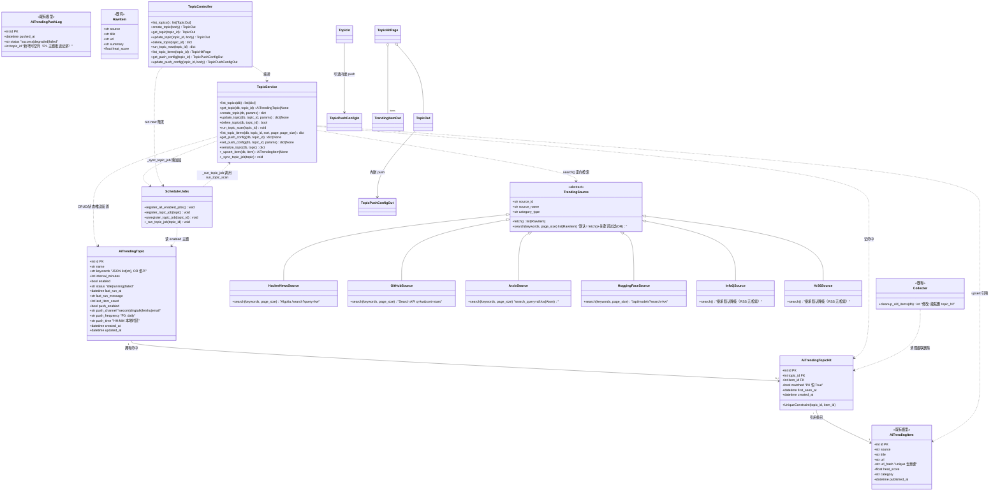
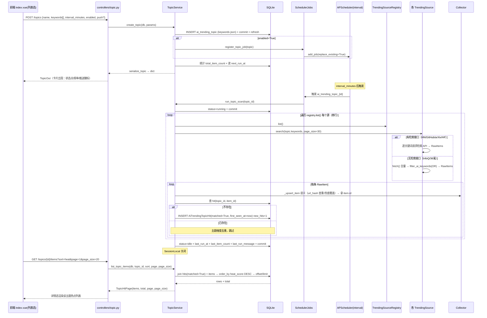
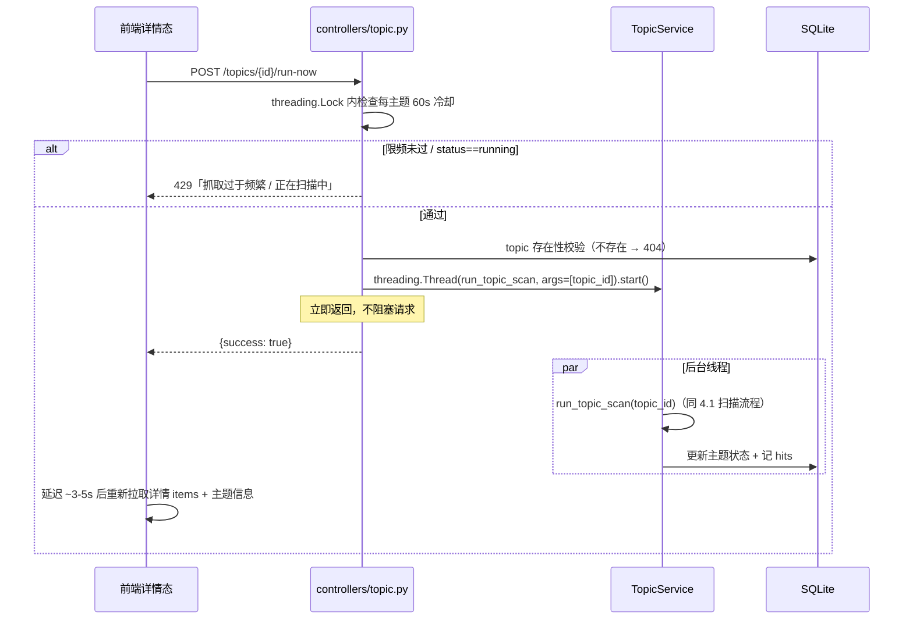
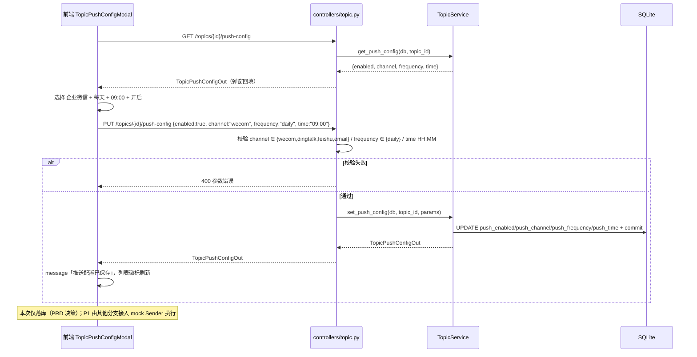
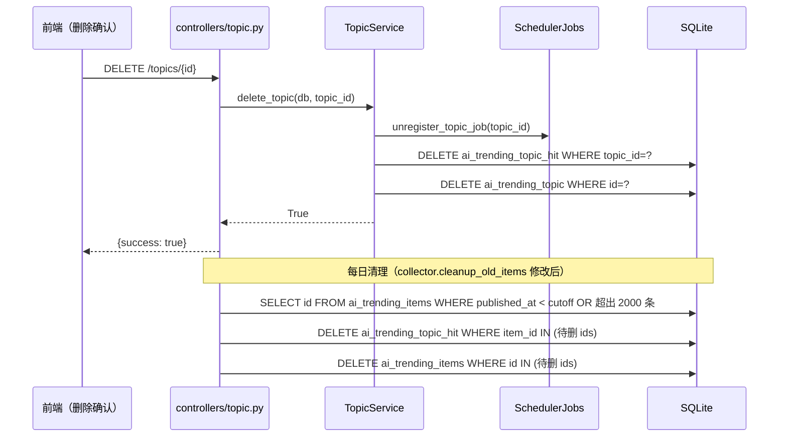
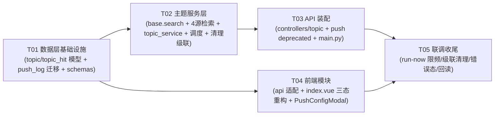

# AI 开发热点聚合 — 增量架构设计：全局热榜 → 主题跟踪模式（重构）

| 项目信息 | 内容 |
|---|---|
| 模块 | `ai_trending` 内重构增量（新增表 `ai_trending_topic` / `ai_trending_topic_hit`，路由 `/api/ai-trending/topics/*`，`push_log` 加 `topic_id` 列） |
| 技术栈 | FastAPI + SQLAlchemy 2.0 + APScheduler（后端）；Vue3 + Vben Admin（web-antd）+ ant-design-vue（前端）；SQLite |
| 上游输入 | `doc/AI_TRENDING_TOPIC_PRD.md`（重构增量 PRD，PM 已定案）+ 主理人补充设计要点（含 push_log 轻量迁移评估） |
| 基线 | `feature/ai-trending` 分支（已上线：6 来源 7 通道全局热榜 + mock 定时推送 + /api/ai-trending/items\|sources\|refresh\|push/*） |
| 既有约定 | 以 `doc/AI_TRENDING_ARCHITECTURE.md` / `AI_TRENDING_PUSH_ARCHITECTURE.md` 为准，本设计只描述增量，不重复既有架构 |
| 主要参照 | XHS 关键词追踪（`backend/app/xhs/models/xhs_tracking_task.py` / `xhs_tracking_hit.py` / `services/tracking.py` / `controllers/tracking.py` / 前端 `views/xhs/tracking/index.vue`） |

---

## Part A：系统设计

### 1. 实现方案与框架选型

#### 1.1 核心难点分析

| 难点 | 风险点 | 对策 |
|---|---|---|
| 4 个源有检索接口、2 个源（InfoQ/36氪）只有全量 RSS | 各源检索协议差异大，且 RSS 源无法真检索 | `TrendingSource` 基类新增**可选 `search(keywords, page_size)`**，默认实现 = `fetch()` 全量 + 关键词过滤（复用 `filter_ai_keywords` OR 语义）；HN/GitHub/arXiv/HF 各自覆写为真检索，InfoQ/36氪 零代码继承降级 |
| 主题命中去重（多主题可命中同一 item，多关键词 OR 重叠） | 同一 item 在多个主题重复展示 / 单主题重复命中刷屏 | 新建 `ai_trending_topic_hit` 关联表（**引用** item_id，不复制条目数据），`Unique(topic_id, item_id)` 主题维度去重；items 表不加 topic_id（多对多 + 全局池语义纯净） |
| 现有库已有 `push_log` 表，SQLAlchemy `create_all` 不会给已存在表加列 | 新代码引用 `topic_id` 列会直接报错 | **轻量迁移**：`ensure_push_log_topic_id()` 用 `inspect(engine)` 查 `PRAGMA table_info`，缺列则 `ALTER TABLE ai_trending_push_log ADD COLUMN topic_id INTEGER`，在 `init_db()` 末尾幂等调用；不引 alembic，零新增依赖 |
| 主题级定时任务生命周期（创建/改频/开关/删除） | job 残留或缺失导致抓取不跑 / 重复跑 | per-topic interval job（id=`ai_trending_topic_{id}`，`replace_existing=True` 幂等），仿 xhs `register_job/unregister_job`；CRUD 联动注册/注销；`register_all_enabled_jobs()` 启动兜底 |
| 主题扫描与全局抓取共享 items 底座但互不污染 | 主题命中混入全局池条目，用户误解「主题=全局过滤」 | 主题命中**只来自 `search()` 结果**（各源定向检索或 RSS 降级过滤），不做「从全局池过滤」；检索结果 upsert 进 items（`url_hash` 去重）后通过 hit 引用，两层数据同源一致 |
| 清理 items 时产生孤儿 hit | 保留策略（7 天/2000 条）删 item 后 hit 悬空 | `collector.cleanup_old_items` 修改：先收集待删 item id → 删对应 `topic_hit` → 再删 items（SQLite 外键默认不强制，必须显式删） |
| GitHub Search API 匿名限额（10 次/分） | 多关键词多主题并发时撞限 | 主题扫描**串行**遍历源（对齐全局抓取串行哲学）；单源失败 `continue` 不阻塞整体；GitHub search 捕获 403/429 降级跳过（后续可配 token） |
| run-now 无 xhs 那种串行 worker 队列 | 重复触发并发扫描 | daemon 线程执行 `run_topic_scan` + 每主题 60s 内存限频（429）+ `status=running` 幂等防重入（扫描中再触发直接拒绝） |

#### 1.2 框架选型（**零新增依赖**，沿用现有约定）

| 能力 | 选型 | 理由 |
|---|---|---|
| HTTP 客户端 | `requests`（已有） | 检索接口全部是 JSON/Atom GET，与现有源 fetch 完全同模式 |
| RSS/Atom 解析 | `feedparser`（已有，arXiv/InfoQ/36氪 已用） | arXiv search 走 Atom，直接复用 |
| HTML 解析 | `lxml`（已有） | GitHub Trending 主通道已有，search 兜底用 Search API 不需要 HTML |
| 定时任务 | `apscheduler`（已有，`app/core/scheduler.py` 单例） | per-topic interval trigger + `replace_existing=True`，与 xhs register_job 同构 |
| ORM | `sqlalchemy>=2.0`（已有，`Mapped`/`mapped_column`） | 与 topic/hit 参照模型一致 |
| 迁移 | `sqlalchemy.inspect` + 原生 `text("ALTER TABLE ...")` | 单列补丁级迁移，幂等，零新依赖 |
| 前端 | Vue3 + ant-design-vue + `@vben/common-ui` + lucide-vue-next | 列表-详情两态仿 xhs tracking；卡片沿用暗色样式 |

#### 1.3 架构模式

- **后端**：沿用四层 `controllers / models / schemas / services`；新增 `services/topic_service.py` 承载主题 CRUD + 扫描编排（仿 xhs `services/tracking.py`），`services/scheduler_jobs.py` 负责 per-topic job 注册（仿 xhs `register_job`），`controllers/topic.py` 只做校验与编排。
- **数据流**：`interval job / run-now → topic_service.run_topic_scan → 各源 search() → upsert items（url_hash 去重）→ 记 topic_hit（Unique 去重）→ 更新主题状态`；主题数据与全局数据共用 `ai_trending_items` 底座。
- **前端**：`views/ai-trending/index.vue` 重构为「主题列表态 ↔ 主题详情态 ↔ 全部热点态」三态单页（仿 xhs tracking 的 `v-if="!selectedTask"` 两态切换 + 现有热榜视图保留）；API 适配层追加 topics 请求函数。

---

### 2. 文件列表

#### 后端（新增 5 + 修改 10；含轻量迁移说明）

```
backend/
├── app/
│   ├── core/
│   │   └── database.py                                 [修改] init_db() 末尾调用 ensure_push_log_topic_id()
│   ├── main.py                                         [修改] include ai_trending_topic_api.router（lifespan 已覆盖 register_all_enabled_jobs）
│   └── ai_trending/
│       ├── models/
│       │   ├── __init__.py                             [修改] 导出 AiTrendingTopic / AiTrendingTopicHit
│       │   ├── topic.py                                [新建] AiTrendingTopic ORM（含内嵌推送配置字段 + 索引）
│       │   ├── topic_hit.py                            [新建] AiTrendingTopicHit ORM（Unique(topic_id, item_id)）
│       │   └── push_log.py                             [修改] 加 topic_id 可空列定义 + ensure_push_log_topic_id() 轻量迁移
│       ├── schemas/
│       │   ├── __init__.py                             [修改] 导出 TopicIn/Out、TopicPushConfigIn/Out、TopicHitPage
│       │   └── topic.py                                [新建] Pydantic 出入参（keywords/channel/frequency/time 校验）
│       ├── services/
│       │   ├── base.py                                 [修改] TrendingSource 新增 search(keywords, page_size) 默认实现（fetch+过滤）
│       │   ├── sources/{hn,github,arxiv,hf}.py         [修改] 4 个源覆写 search()（真检索）
│       │   │   # infoq.py / kr36.py 不改：继承默认降级
│       │   ├── topic_service.py                        [新建] topic CRUD + run_topic_scan + hits + 状态更新 + 推送配置
│       │   ├── collector.py                            [修改] cleanup_old_items 级联删除 topic_hit
│       │   └── scheduler_jobs.py                       [修改] register/unregister_topic_job + register_all_enabled_jobs 增补
│       └── controllers/
│           ├── __init__.py                             [修改] 导出 topic router（或 main.py 直接 import）
│           ├── topic.py                                [新建] /api/ai-trending/topics/* 路由（CRUD + run-now + items + push-config）
│           └── push.py                                 [修改] 4 个全局推送端点加 deprecated=True（保留可用）
```

> **轻量迁移说明（重要）**：新建库时 `Base.metadata.create_all` 会把 `push_log.topic_id` 一并建出（ORM 列定义包含即可）；**存量库** `create_all` 不会给已存在的 `ai_trending_push_log` 表加列，因此在 `push_log.py` 提供 `ensure_push_log_topic_id()`：`inspect(engine).get_columns('ai_trending_push_log')` 缺 `topic_id` 时执行 `ALTER TABLE ai_trending_push_log ADD COLUMN topic_id INTEGER`，`init_db()` 在 `create_all` 之后调用（幂等，重启安全）。`ai_trending_topic` / `ai_trending_topic_hit` 为新表，`create_all` 自动建，无需迁移。

#### 前端（新增 1 + 修改 2）

```
frontend/apps/web-antd/src/
├── api/core/ai-trending.ts                             [修改] 新增 Topic/TopicPushConfig/TopicHitPage 类型 + topics 相关 8-9 个请求函数
├── views/ai-trending/index.vue                         [重构] 列表-详情两态 + 全部热点态；移除全局推送卡片；新建/编辑主题弹窗
└── views/ai-trending/components/TopicPushConfigModal.vue [新建] 推送配置弹窗（channel 下拉/频率/时间/开关/保存）
```

---

### 3. 数据结构与接口

#### 3.1 数据库表设计

**表 `ai_trending_topic`（主题，仿 `xhs_tracking_tasks`）**

| 字段 | 类型 | 约束/默认 | 说明 |
|---|---|---|---|
| id | int | PK | 主键 |
| name | str(128) | | 主题名称（如「AI Agent」「大模型开源」） |
| keywords | Text | 默认 "[]" | JSON 数组 `["agent","multi-agent","智能体"]`；多关键词 **OR** 命中（任一命中即算） |
| interval_minutes | int | 默认 60 | 抓取频率（对齐 xhs：15/30/60/180/360/720/1440） |
| enabled | bool | 默认 True | 主题开关；false 时不注册 job、不抓取 |
| status | str(16) | 默认 "idle" | idle / running / failed（对齐 xhs） |
| last_run_at | DateTime | 可空 | 最近一次抓取时间 |
| last_run_message | Text | 可空 | 最近一次抓取结果/失败原因（截断 500 字） |
| last_item_count | int | 默认 0 | 最近一次抓取新增命中数 |
| push_enabled | bool | 默认 False | 主题推送总开关（内嵌推送配置） |
| push_channel | str(16) | 默认 "wecom" | `wecom` / `dingtalk` / `feishu` / `email`（占位枚举，仅保存） |
| push_frequency | str(16) | 默认 "daily" | 推送频率（P0 仅 `daily`，P1 扩展 hourly 等） |
| push_time | str(5) | 默认 "09:00" | 推送时间 HH:MM（服务器本地时区，对齐既有 push 口径） |
| created_at / updated_at | DateTime | 默认 now | 时间戳 |

> 索引：表量小，主键足够；可选 `enabled` 单列索引服务启动时 `register_all_enabled_jobs()` 查询（数据量大再加，非必须）。

**表 `ai_trending_topic_hit`（主题命中，仿 `xhs_tracking_hits`，引用 items 不复制）**

| 字段 | 类型 | 约束/默认 | 说明 |
|---|---|---|---|
| id | int | PK | 主键 |
| topic_id | int | FK → ai_trending_topic.id，index | 所属主题 |
| item_id | int | FK → ai_trending_items.id，index | 命中的热点条目（**引用**） |
| matched | bool | 默认 True | 命中标记（预留过滤语义，P0 恒 True） |
| first_seen_at | DateTime | 默认 now | 该主题首次见到该条目的时间（详情「最新」排序键） |
| created_at | DateTime | 默认 now | 记录创建时间 |

> 约束：`UniqueConstraint("topic_id", "item_id", name="uq_ai_trending_topic_item")` — 主题维度去重，重复扫描不新增 hit。
> 级联：删除主题时显式删 hits；清理 items 时显式删对应 hits（见 1.1 / 4.4）。

**表 `ai_trending_push_log`（既有，加一列）**

| 字段 | 类型 | 约束/默认 | 说明 |
|---|---|---|---|
| topic_id | int | 可空 | **新增列**：非空 = 主题推送记录，空 = 全局推送记录（P0 主题推送不执行，P1 使用） |

#### 3.2 类图



#### 3.3 接口定义

**`services/base.py` 增量（search 默认降级）**

```python
def search(self, keywords: list[str], page_size: int = 30) -> list[RawItem]:
    """默认降级实现：fetch() 全量抓取后按关键词过滤（标题+摘要，OR 语义）。
    有检索接口的源（HN/GitHub/arXiv/HF）覆写为真检索；
    无检索接口的源（InfoQ/36氪）直接用本实现（全量 feed + 关键词过滤）。
    子类实现建议：按关键词循环请求 + 本地 url_hash 去重合并。"""
    items = self.fetch() or []
    if not keywords:
        return items
    return [it for it in items if filter_ai_keywords(it.title, it.summary, keywords)]
```

**各源 `search(keywords, page_size=30)` 检索规格**

| 源 | 请求 | 解析 |
|---|---|---|
| hn | `GET https://hn.algolia.com/api/v1/search?query={kw}&tags=story&hitsPerPage={page_size}`（逐关键词循环） | 复用 fetch 的 hit 解析（points/num_comments → hn_heat） |
| github | `GET https://api.github.com/search/repositories?q={kw}&sort=stars&order=desc&per_page={page_size}`（URL 编码；捕获 403/429 抛 TrendingSourceError 由调用方跳过） | 复用 `_fetch_search_api` 的 repo 解析（stargazers_count → github_heat） |
| arxiv | `GET https://export.arxiv.org/api/query?search_query=all:%22{kw}%22&sortBy=submittedDate&sortOrder=descending&max_results={page_size}`（逐关键词循环，URL 编码引号） | feedparser 解析（复用 fetch 的 entry 解析 → paper_heat） |
| hf | `GET https://huggingface.co/api/models?search={kw}&sort=trendingScore&direction=-1&limit={page_size}`（逐关键词循环） | 复用 `_fetch_models` 解析（trendingScore → hf_models_heat） |
| infoq / kr36 | 不覆写 | 基类默认（fetch 全量 + 关键词过滤） |

> 多关键词 OR：每个关键词各请求一次，合并 RawItems（`url_hash` 维度去重可省——upsert 与 hit Unique 已兜底，量小无需预去重）。

**`services/topic_service.py`（核心，仿 xhs `services/tracking.py`）**

```python
JOB_ID_PREFIX = "ai_trending_topic_"          # 与 scheduler_jobs._topic_job_id 一致
ALLOWED_INTERVALS = (15, 30, 60, 180, 360, 720, 1440)
ALLOWED_CHANNELS = ("wecom", "dingtalk", "feishu", "email")
ALLOWED_FREQUENCIES = ("daily",)              # P0 仅 daily
SEARCH_PAGE_SIZE = 30

def serialize_topic(db, topic) -> dict:
    """{id, name, keywords[], interval_minutes, enabled, status, last_run_at,
        last_run_message, last_item_count, total_item_count, next_run_at,
        push:{enabled, channel, frequency, time}, created_at}
    - total_item_count = count(hits where topic_id & matched=True)
    - next_run_at = 读 APScheduler job.next_run_time.isoformat()（未注册=None，不硬推算）
    - keywords/push 从 JSON/内嵌字段组装"""

def list_topics(db) -> list[dict]: ...          # created_at DESC
def get_topic(db, topic_id) -> AiTrendingTopic | None: ...
def create_topic(db, params) -> dict:
    """校验 name/keywords/interval/push 由 controller/Pydantic 完成；
    建行（keywords json.dumps ensure_ascii=False）→ commit → refresh →
    enabled 则 _sync_topic_job(topic)（懒加载 scheduler_jobs.register_topic_job）→ serialize"""
def update_topic(db, topic_id, params) -> dict | None:
    """字段全量覆盖（对齐 xhs PUT 语义）；commit+refresh；
    enabled→register_topic_job（replace_existing=True 幂等）；否则 unregister_topic_job"""
def delete_topic(db, topic_id) -> bool:
    """unregister_topic_job(id) → 删 topic_hit（显式）→ 删 topic → commit"""
def run_topic_scan(topic_id: int) -> None:
    """调度器线程 / run-now 线程执行，SessionLocal() 自开自关（对齐 xhs run_scan）：
    1. topic 不存在 或 未启用 → return
    2. topic.status = "running" + commit
    3. keywords = json.loads(topic.keywords)
    4. 遍历 registry.list()：source.search(keywords, SEARCH_PAGE_SIZE)
       单源 TrendingSourceError/异常 → logger.warning + continue（不阻塞整体）
    5. 逐条 _upsert_item(db, item)（复用 url_hash 去重/热度覆盖语义，返回 ORM 拿到 id）
       → 查 hit(topic_id, item_id) 不存在则 INSERT(matched=True, first_seen_at=now) new_hits+1
    6. topic.status=idle, last_run_at=now, last_run_message=f"扫描完成，本次新增命中 {new_hits} 条",
       last_item_count=new_hits；异常 → status=failed + message=str(e)[:500]
    7. commit；finally db.close()"""
def list_topic_items(db, topic_id, sort="heat", page=1, page_size=20) -> dict:
    """join hits(matched=True) + items：
    sort=heat → items.heat_score DESC, items.id DESC
    sort=time → hit.first_seen_at DESC, items.id DESC
    返回 {items:[TrendingItemOut], total, page, page_size}"""
def get_push_config(db, topic_id) -> dict | None:
    """{enabled, channel, frequency, time}"""
def set_push_config(db, topic_id, params) -> dict | None:
    """仅落库 topic 内嵌四字段 + commit；本次不注册任何推送 job（P1 接入）"""
```

**`services/scheduler_jobs.py` 增量**

```python
TOPIC_JOB_PREFIX = "ai_trending_topic_"

def _topic_job_id(topic_id: int) -> str: return f"{TOPIC_JOB_PREFIX}{topic_id}"

def _run_topic_job(topic_id: int) -> None:
    """SessionLocal() 自开自关（参考 _run_source_job / xhs _record_task 模式）；
    topic_service.run_topic_scan(topic_id)；异常 logger.exception 兜底"""
def register_topic_job(topic) -> None:
    """enabled=False → unregister_topic_job 并 return；
    add_job(func=_run_topic_job, trigger="interval", minutes=topic.interval_minutes,
            id=_topic_job_id(topic.id), args=[topic.id], replace_existing=True)"""
def unregister_topic_job(topic_id: int) -> None: ...   # JobLookupError 兜底

# register_all_enabled_jobs() 末尾追加：
#   db = SessionLocal(); topics = db.query(AiTrendingTopic).filter(enabled=True).all()
#   for t in topics: register_topic_job(t); db.close()
```

**`controllers/topic.py`（`APIRouter(prefix="/api/ai-trending", tags=["ai-trending-topic"])`，全部 `Depends(get_current_user)`）**

```
GET    /topics                                    → TopicOut[]
       # [{id, name, keywords[], interval_minutes, enabled, status, last_run_at,
       #   last_run_message, last_item_count, total_item_count, next_run_at,
       #   push:{enabled, channel, frequency, time}, created_at}]

POST   /topics                                    → TopicOut
       # body: {name, keywords[], interval_minutes?, enabled?, push?}
       # 校验：name 非空≤128；keywords 非空数组且每项 strip 非空（≤20 个）；interval ∈ 允许集合；push.time HH:MM

GET    /topics/{topic_id}                         → TopicOut | 404

PUT    /topics/{topic_id}                         → TopicOut | 404
       # 同 POST 校验；字段全量覆盖；enabled/interval 变化自动重注册 job

DELETE /topics/{topic_id}                         → {success: true} | 404
       # 注销 job + 显式删 topic_hit + 删 topic（删除确认文案提示清空命中）

POST   /topics/{topic_id}/run-now                 → {success: true} | 404 | 429
       # 限频：进程内 _last_run_now: dict[int, float] + threading.Lock，每主题 60s，未过 → 429
       # topic.status == running → 429「该主题正在扫描中」
       # daemon 线程 threading.Thread(target=topic_service.run_topic_scan, args=(topic_id,)).start()，立即返回

GET    /topics/{topic_id}/items?sort=heat|time&page=1&page_size=20 → TopicHitPage
       # join hits+items（matched=True）；sort=heat 默认 / sort=time 按 first_seen_at

GET    /topics/{topic_id}/push-config             → TopicPushConfigOut | 404
PUT    /topics/{topic_id}/push-config             → TopicPushConfigOut | 404
       # body: {enabled, channel: wecom|dingtalk|feishu|email, frequency: daily, time: HH:MM}
       # 仅落库，不触发真实发送（提示文案：实际发送通道开发中）
```

**`controllers/push.py` 增量**：4 个全局推送端点（config GET/PUT、latest、test）全部加 `deprecated=True` 参数（FastAPI 自动打 OpenAPI 弃用标记），**逻辑零改动**，保留可用；`push_config` 表不删。

**`schemas/topic.py`（Pydantic v2）**

```python
class TopicPushConfigIn(BaseModel):
    enabled: bool = False
    channel: str = "wecom"            # field_validator ∈ {wecom, dingtalk, feishu, email}
    frequency: str = "daily"          # field_validator ∈ {daily}（P0）
    time: str = "09:00"               # field_validator: HH:MM + 时/分范围（复用 push 的校验逻辑）

class TopicIn(BaseModel):
    name: str = Field(..., min_length=1, max_length=128)
    keywords: list[str] = Field(..., min_length=1)   # field_validator: strip、去空、≤20 项、每项 ≤50 字
    interval_minutes: int = Field(60)                # field_validator ∈ ALLOWED_INTERVALS
    enabled: bool = True
    push: TopicPushConfigIn | None = None            # 可选内嵌，保存时合并默认值

class TopicPushConfigOut(BaseModel):
    enabled: bool; channel: str; frequency: str; time: str

class TopicOut(BaseModel):
    id: int; name: str; keywords: list[str]; interval_minutes: int; enabled: bool
    status: str; last_run_at: datetime | None; last_run_message: str | None
    last_item_count: int; total_item_count: int; next_run_at: str | None
    push: TopicPushConfigOut; created_at: datetime
    # 由 service serialize_topic 构造（含计算字段），不用 from_attributes

class TopicHitPage(BaseModel):
    items: list[TrendingItemOut]      # 复用 schemas/trending.py
    total: int; page: int; page_size: int
```

---

### 4. 程序调用流程

#### 4.1 主题创建 → 注册定时 job → 关键词检索 → 记 hits → 详情查询



#### 4.2 run-now 立即抓取（限频 + 异步线程）



#### 4.3 推送配置保存流（仅落库，不触发真实发送）



#### 4.4 删除主题（注销 job + 级联删 hits）与 items 清理级联



---

### 5. 待明确事项（假设与已拍板决策）

| # | 事项 | 本设计采用的假设/决策 |
|---|---|---|
| 1 | 旧热榜页去留 | **已拍板保留**为「全部热点」二级视图（数据底座 + `/sources` 健康状态继续可用），前端 index.vue 顶部提供入口 |
| 2 | 推送频率语义 | **P0 仅 daily**（frequency 落库占位，前端其余选项置灰「即将支持」）；interval 型频率 P1 再做 |
| 3 | 主题抓取与全局抓取关系 | 全局每小时抓取**保留**作数据底座；主题命中只来自 `search()` 结果，不做「全局池过滤」 |
| 4 | 多关键词匹配 | **P0 OR**（任一命中即算主题命中）；AND（must_include）留给 P1 对齐 XHS |
| 5 | 来源检索能力差异 | InfoQ/36氪 **接受降级**（fetch 全量 + 关键词过滤），命中照常 upsert + 记 hit |
| 6 | 推送通道参数 | 本轮 topic 只存 channel 枚举；webhook/收件人等参数在真实通道分支开发时新增字段（不引独立表，避免过度设计） |
| 7 | run-now 并发控制 | ai_trending 无 xhs 串行 worker，采用 **daemon 线程 + 每主题 60s 限频 + status=running 防重入**（单进程部署成立） |
| 8 | push_log.topic_id 迁移 | **ALTER TABLE ADD COLUMN**（幂等 helper 在 init_db 调用）；P0 仅加列不建索引（P1 主题推送查询需要时再建） |
| 9 | 统一 Task 表记录 | 主题扫描记入 `Task`（module='ai_trending'，仿 xhs `_record_task`）列为 **P1 可选**，P0 用 topic.last_run_message + loguru 留痕 |
| 10 | 主题抓取 page_size | 默认 30/关键词（对齐 xhs require_num 50 的量级，降低上游压力）；GitHub 匿名限额靠串行 + 单源失败跳过兜底 |
| 11 | 删除主题的 hits 清理 | 显式 DELETE（SQLite 外键默认不强制，不能依赖 ondelete=CASCADE） |
| 12 | 全局推送 cron | `register_push_job()` **保留**（deprecated 但向后兼容：已启用配置的用户仍收到推送）；P1 主题推送接入后如需关闭再移除 |

---

## Part B：任务分解

### 6. 依赖包清单

**无新增依赖（后端 + 前端均为零）**。

```
后端复用（均已存在）：
- requests: 各源检索 API / feed 请求
- feedparser>=6.0: arXiv search 的 Atom 解析（既有）
- lxml: GitHub 主通道（既有；search 走 Search API 不需要）
- apscheduler>=3.10: per-topic interval job 注册
- sqlalchemy>=2.0: ORM + inspect 轻量迁移
- fastapi / pydantic v2: API 与出入参校验
- loguru: 日志
- sqlalchemy.inspect + text: ALTER TABLE 幂等迁移（标准库级别，无新依赖）

前端复用（均已存在）：
- ant-design-vue: Card/Modal/Form/Select/TimePicker/Switch/Tag/Segmented/Tabs/Pagination/Alert/message
- lucide-vue-next: 卡片图标（Flame/Bell/Plus/RefreshCw/MoreHorizontal/ArrowLeft 等）
- @vben/common-ui: Page 布局
- dayjs: 时间选择
```

### 7. 任务列表（按依赖顺序，共 5 个）

> 说明：本重构为增量改造，无新增配置文件、入口文件与依赖声明，故「基础设施」任务收敛为**数据层基础设施**（新表 + 迁移 + schemas + 模型导出）——它是全部后续任务的地基，等价于首任务定位。

| 任务 | 名称 | 源文件 | 依赖 | 优先级 |
|---|---|---|---|---|
| **T01** | 数据层基础设施：topic/topic_hit 模型 + push_log 轻量迁移 + schemas | 新建 `backend/app/ai_trending/models/topic.py`、`models/topic_hit.py`、`schemas/topic.py`；修改 `models/push_log.py`（topic_id 列 + `ensure_push_log_topic_id()`）、`models/__init__.py`（导出）、`schemas/__init__.py`（导出）、`backend/app/core/database.py`（init_db 末尾调迁移） | 无 | P0 |
| **T02** | 主题服务层：search 检索 + topic_service + 定时 job + 清理级联 | 修改 `backend/app/ai_trending/services/base.py`（search 默认实现）、`services/sources/{hn,github,arxiv,hf}.py`（4 源 search 覆写）、`services/collector.py`（cleanup 级联删 hit）、`services/scheduler_jobs.py`（register/unregister_topic_job + register_all_enabled_jobs 增补）；新建 `services/topic_service.py` | T01 | P0 |
| **T03** | API 装配：topic 控制器 + 旧 push 端点 deprecated + main.py | 新建 `backend/app/ai_trending/controllers/topic.py`；修改 `controllers/push.py`（4 端点 `deprecated=True`）、`controllers/__init__.py`（导出）、`backend/app/main.py`（include router） | T02 | P0 |
| **T04** | 前端模块：API 适配层 + 列表-详情两态重构 + 推送配置弹窗组件 | 修改 `frontend/apps/web-antd/src/api/core/ai-trending.ts`、`views/ai-trending/index.vue`（重构三态 + 移除全局推送卡片）；新建 `views/ai-trending/components/TopicPushConfigModal.vue` | T01（API 契约，可与 T02/T03 并行） | P0 |
| **T05** | 端到端联调与收尾：run-now 限频/级联清理/错误态/推送配置回读 | 修改 `backend/app/ai_trending/controllers/topic.py`、`services/topic_service.py`、`services/scheduler_jobs.py`、`views/ai-trending/index.vue` | T03、T04 | P1 |

**T01 说明**：`AiTrendingTopic`（name/keywords JSON/interval/enabled/status/last_run_*/last_item_count/push_enabled/push_channel/push_frequency/push_time/created_at/updated_at）、`AiTrendingTopicHit`（topic_id FK index、item_id FK index、matched、first_seen_at、`UniqueConstraint(topic_id,item_id)`）；`push_log.py` 加 `topic_id` 可空列 + `ensure_push_log_topic_id()`（`inspect` 查列 → `ALTER TABLE ADD COLUMN`，幂等）；`database.py` 的 `init_db()` 在 `create_all` 后调用迁移；`schemas/topic.py` 实现 `TopicIn`（keywords 非空数组/interval 允许集合/push.time HH:MM 校验器）、`TopicOut`（含 total_item_count/next_run_at/push 内嵌）、`TopicPushConfigIn/Out`、`TopicHitPage`（复用 TrendingItemOut）。验收：全新库 init_db 后出现两张新表 + push_log 含 topic_id；存量库重启后自动补列；Pydantic 校验用例（空 keywords / 非法 interval / 非法 channel / 非法 time）报 400。

**T02 说明**：`base.py` 的 `TrendingSource.search()` 默认 = fetch + `filter_ai_keywords`（OR）；HN（Algolia `search?query=`）、GitHub（Search API `q=&sort=stars`，403/429 抛错跳过）、arXiv（`search_query=all:"kw"` Atom）、HF（`/api/models?search=`）覆写真检索；InfoQ/36氪 用默认；`topic_service.py` 实现 `serialize_topic`（total_item_count/next_run_at/关键词解析）+ CRUD（创建/更新/删除联动 job）+ `run_topic_scan`（串行遍历源 → `_upsert_item` 复用去重 → 记 hit Unique 去重 → 三态状态更新 + last_run_*）+ `list_topic_items`（join 分页排序）+ push-config get/set；`collector.cleanup_old_items` 先收集待删 item id → 删 topic_hit → 删 items；`scheduler_jobs.py` 加 `TOPIC_JOB_PREFIX` + `_run_topic_job` + `register/unregister_topic_job`（interval trigger，replace_existing=True），`register_all_enabled_jobs()` 末尾遍历 enabled 主题注册。验收：新建主题后 APScheduler 出现 `ai_trending_topic_{id}` job；run_topic_scan 后 items 有数据、hit 不重复、主题状态/计数正确；单源失败（如 GitHub 403）不阻塞其他源；清理 job 删除 items 时对应 hit 同步消失。

**T03 说明**：`controllers/topic.py` 实现 9 个端点（topics CRUD + run-now 含每主题 60s 限频与 running 防重入 + items + push-config GET/PUT），全部 `Depends(get_current_user)`，校验失败 400 / 不存在 404 / 限频 429；`controllers/push.py` 4 个端点加 `deprecated=True`（逻辑不动）；main.py include router。验收：curl 全端点按预期返回；旧 push 端点仍可用且 OpenAPI 标记 deprecated；/items /sources /refresh 语义不变。

**T04 说明**：`api/core/ai-trending.ts` 加 `Topic` / `TopicPushConfig` / `TopicParams` / `TopicHitPage` 类型与 8-9 个请求函数（listTopicsApi / createTopicApi / getTopicApi / updateTopicApi / deleteTopicApi / runTopicNowApi / listTopicItemsApi / getTopicPushConfigApi / updateTopicPushConfigApi）；`index.vue` 重构为三态单页（列表态：主题卡片网格 + 状态点/最近抓取相对时间/命中数/推送徽标 + 立即抓取/推送配置/更多编辑删除 + 新建主题按钮 + 全部热点入口；详情态：返回 + 主题信息头 + 复用现有热榜列表卡片 + 详情弹窗跳原文 + 分页；全部热点态：保留现有来源 Tab/筛选/排序/列表），**删除顶部全局推送卡片及其状态/函数**（pushConfig/latestPush/loadPushConfig/loadLatestPush/savePushConfig/testPush 及 Bell/Send 相关 import）；新建 `TopicPushConfigModal.vue`（channel 下拉 wecom/dingtalk/feishu/email、frequency 下拉 daily 其余置灰、TimePicker、Switch、提示文案「实际发送通道开发中，本次仅保存配置」、保存调 PUT push-config）。验收：页面默认主题列表；新建主题保存后卡片出现且 next_run_at 有值；点卡片进详情、返回正常；推送配置保存后回读一致、列表徽标更新；全站搜索无「定时推送卡片」残留代码；「全部热点」视图与来源状态正常。

**T05 说明**：联调验证——run-now 60s 限频 429 + running 防重入；主题抓取与全局抓取并行时同一 URL 只一行（url_hash 去重）、同主题重复抓取不新增 hit；删除主题级联清 hit、items 不受影响、job 注销；清理任务级联删 hit；推送配置（企业微信 + 每天 + 09:00 + 开）保存回读一致且不触发真实发送；重启后 register_all_enabled_jobs 幂等重挂全部 enabled 主题；存量库迁移幂等；修复联调问题。

### 8. 共享知识（跨文件约定）

**既有约定（沿用）**
- 日志：统一 `from loguru import logger`；正常 `logger.info`、警告 `logger.warning`、异常 `logger.exception`（带堆栈）；主题扫描成功/失败必须留痕（`last_run_message` + logger）。
- 时间：库内一律 `datetime.now(timezone.utc)`；DateTime 列存 aware 时间；对外 API 序列化 `isoformat()`；前端 `new Date(iso)` 本地渲染。
- **时区口径**：`push_time`（HH:MM）与 APScheduler 定时触发按**服务器本地时区**解释（与既有 push cron 一致）。
- URL 归一化 / url_hash：沿用 `base.py` 规则（小写 scheme/host、去尾斜杠、去 utm_*/ref/source、arXiv 去版本号、HF 归一化 id）；`url_hash` 是 items 全局去重键。
- category / source_id 枚举：`news/project/paper/model`；`hn/github/arxiv/hf_models/hf_papers/infoq/kr36`；HF 前端 Tab 合并展示，后端 `hf` 别名查询两个子源。
- tags / heat_meta / keywords：JSON 字符串存储，`json.dumps(..., ensure_ascii=False)`；读取 `json.loads`。
- 依赖注入：`db: Session = Depends(get_db)`、`_=Depends(get_current_user)`；controller 只做参数校验与编排。
- HTTP 错误语义：400 参数错 / 404 不存在 / 429 限频 / 502 上游抓取失败（对齐 resource/trending）。
- SQLite 并发：调度器线程内 `SessionLocal()` 自开自关，不跨线程共享 Session（同 `_run_source_job` / xhs `run_scan`）。
- 重试：手动循环 `RETRY_DELAYS=(5, 15)`（初始 + 2 次重试）仅在需要时对关键源使用；主题扫描单源失败直接 `continue` 不重试（避免多关键词多源叠加过久）。

**新增约定（topic 相关）**
- `topic.status` 枚举：`idle` / `running` / `failed`；`last_run_message` 截断 500 字。
- `keywords` 语义：JSON 数组、**OR** 命中（`filter_ai_keywords(title, summary, keywords)` 任一命中即记 hit）；P0 不做 AND/must_exclude。
- 主题命中语义：`AiTrendingTopicHit.matched` P0 恒 True；`Unique(topic_id, item_id)` 是主题维度去重键（重复扫描不新增）；hit 只**引用** `ai_trending_items.id`，不复制条目数据。
- **job id 约定**：per-topic interval job = `ai_trending_topic_{topic_id}`，`trigger="interval", minutes=interval_minutes`，`replace_existing=True`；enabled=False 不注册；CRUD 联动注册/注销；启动由 `register_all_enabled_jobs()` 兜底。全局源 job（`ai_trending_hn` 等）与 `ai_trending_push` / `ai_trending_cleanup` 保持不动。
- 推送配置：`push_channel` 枚举 `wecom/dingtalk/feishu/email`（占位，仅保存）；`push_frequency` P0 仅 `daily`；`push_time` HH:MM 本地时区；**本次不注册主题推送 job、不触发真实发送**（P1 复用 `build_sender()` + `push_service` 管线接入）。
- 清理级联：`collector.cleanup_old_items` 删除 items 前先收集 id → 显式删 `topic_hit` → 删 items；删除主题同理（SQLite 外键默认不强制，禁止依赖 DB 级 CASCADE）。
- 轻量迁移：`ensure_push_log_topic_id()` 在 `init_db()` 的 `create_all` 之后调用，幂等；新库由 ORM 建列，存量库 ALTER 补列；不引 alembic。
- run-now：daemon 线程 + 每主题 60s 内存限频 + `status=running` 防重入；单进程部署成立（与 `/refresh` 限频同模式）。
- 主题扫描容错：遍历源时单源 `TrendingSourceError`/异常 → `logger.warning` + `continue`，不阻塞整体；GitHub Search 匿名限额（10 次/分）靠串行扫描 + 失败跳过兜底，后续可配 token。
- 兼容性：`push_config` 表不删；旧 `/push/*` 端点保留可用但 `deprecated=True`；`/items` `/sources` `/refresh` 语义不变；`push_log.topic_id` 为 NULL 表示全局推送记录。

### 9. 任务依赖图



---

## 附：设计对齐检查

- 与重构 PRD 一致：新增 `ai_trending_topic`（含内嵌推送配置）+ `ai_trending_topic_hit`（Unique(topic_id,item_id)）；`TrendingSource.search()` 基类默认降级 + HN/GitHub/arXiv/HF 真检索、InfoQ/36氪 降级；per-topic interval job + `register_all_enabled_jobs()` 兜底；主题详情 join hits+items；主题级推送配置仅落库（channel 占位枚举 + P0 仅 daily + HH:MM）；前端移除全局推送卡片、列表-详情两态仿 XHS；旧 push API 保留 deprecated、`push_config` 表不删、`/items` 语义不变。
- 与主理人设计要点一致：`push_log` 加 `topic_id` 可空列（SQLite `ALTER TABLE ADD COLUMN` 轻量迁移，幂等）；hit 引用 item_id 不复制（items 不加 topic_id）；`search()` 默认实现 = fetch + 关键词过滤；多关键词 OR；清理级联删 hit；run-now 限频防重入。
- 与现有代码风格一致：四层模块结构、`Mapped/mapped_column` ORM、`register_all_enabled_jobs()` lifespan 注册、`APIRouter(prefix=...)` + `Depends(get_current_user)`、前端 namespace API + 暗色卡片、手动重试循环、内存限频、`SessionLocal()` 自开自关。
- 依赖最小化：**零新增依赖**（检索复用 requests，迁移用 sqlalchemy.inspect + 原生 SQL）。
