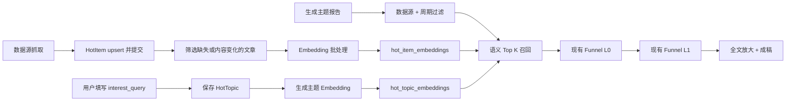

# Hotlist 主题语义检索实现方案

> 状态：实施设计稿  
> 适用范围：`backend/app/hotlist`、Workbench AI Gateway、主题管理前端  
> 目标：用自然语言关注需求 + Embedding 语义召回替代主题关键词规则，并复用现有报告 Funnel 完成精排与成稿。

## 1. 背景与结论

当前主题报告的候选条目由 `backend/app/hotlist/services/topic_report_service.py::fetch_candidates()` 产生：

1. 按主题启用的数据源和报告周期查询 `hot_items`；
2. 按 `weight` 取 `max_items * 3`；
3. 加载主题关键词规则，对 `title + summary` 做字符串匹配；
4. 截断到 `max_items`，交给 `simple / two_stage / funnel`。

这对“AI 工具链”一类概念型需求召回不足。相关内容可能只出现 Agent runtime、MCP、RAG observability、模型网关等词，用户难以穷举关键词；关键词过严时当前代码会直接报“没有符合关键词规则的条目”。

本方案采用以下结论：

- 在主题“分析配置”中新增独立的 `interest_query`（关注需求），例如“我想看 AI 工具链相关的新闻或者知识”。
- 文章抓取入库后生成 Embedding，并独立保存在与 `hot_items` 一一关联的向量表中。
- 报告生成前按主题、时间和数据源取得候选文章，计算与主题需求的余弦相似度并召回 Top K。
- 语义召回结果继续进入现有 Funnel；短期不新增 reranker，不改变现有 L0/L1/L2 的主流程。
- 删除主题关键词规则、全局关键词过滤和旧规则命中模型；主题相关性只有“语义检索”一个实现。
- 第一阶段继续使用 SQLite，在 Python 中批量计算相似度；达到规模阈值后再迁移 PostgreSQL + pgvector。

本项目按全新数据库设计，不考虑旧表、旧数据和接口兼容。实现时直接修改 ORM 模型和初始化结构，不增加 `ALTER TABLE`、表重建、双写、旧字段兜底等迁移代码。开发数据库可直接删除后重新初始化。

## 2. 现有代码影响分析

### 2.1 后端关键位置

| 现有文件 | 当前职责 | 本次调整 |
|---|---|---|
| `models/hot_topic.py` | 分析、周期和通知配置 | 增加关注需求与召回参数 |
| `models/hot_item.py` | 文章主记录 | 不存向量，保持列表查询轻量 |
| `models/hot_item_content.py` | 全文缓存 | 暂不用于第一版 Embedding |
| `services/crawl_service.py` | 抓取、upsert、规则命中、推送 | 改为提交文章后批量补向量并计算语义命中 |
| `services/topic_report_service.py` | 候选查询、Funnel、成稿 | 用语义召回替换主题关键词过滤 |
| `services/push_service.py` | 按旧规则命中推送 | 直接改为读取 `HotSemanticHit` |
| `schemas/topic.py` | 主题 API 入出参 | 增加召回字段和校验 |
| `services/topic_service.py` | 主题 CRUD | 保存配置，需求变化时使主题向量失效 |
| `core/database.py` | 数据库初始化及历史兼容逻辑 | 新项目仅用 ORM 元数据创建目标表，删除 hotlist 历史补丁迁移 |

### 2.2 前端关键位置

| 现有文件 | 调整 |
|---|---|
| `views/hotlist/topics/components/TopicDetailPanel.vue` | 删除“关键词规则”步骤，在“分析配置”增加“关注需求”和语义召回配置 |
| `views/hotlist/topics/components/RuleTab.vue` | 删除文件及对应路由/API |
| `api/core/hotlist.ts` | 扩展 Topic 类型，增加语义预览和补算接口类型 |

### 2.3 AI Gateway 现状

`app/common/services/ai_gateway/base.py::AIRequest` 只描述生成式对话请求，当前不存在统一 Embedding 接口。因此不能把聊天模型名直接当作向量模型名，也不能在 hotlist 业务中硬编码某一家厂商的 URL。

本次应新增独立的 Embedding Gateway，并为向量模型保存完整版本标识。聊天模型与向量模型分别配置、分别演进。

## 3. 目标数据流



关键边界：

- 抓取成功不依赖 Embedding 成功；向量服务故障不能回滚文章。
- Embedding 只负责粗召回；LLM Funnel 负责精筛、分组和写作。
- `interest_query` 决定“找什么”，`extra_question` 决定“找到后怎么写”，二者不可合并。

## 4. 数据模型

### 4.1 `hot_topics` 新增字段

在 `HotTopic` 增加：

```python
interest_query: Mapped[str] = mapped_column(Text, default="")
retrieval_mode: Mapped[str] = mapped_column(String(16), default="semantic")
similarity_threshold: Mapped[float] = mapped_column(Float, default=0.35)
retrieval_size: Mapped[int] = mapped_column(Integer, default=100)
```

字段语义：

| 字段 | 默认值 | 说明 |
|---|---:|---|
| `interest_query` | 空 | 用户自然语言需求；启用主题报告时应要求非空 |
| `retrieval_mode` | `semantic` | 第一版只开放 `semantic`；保留未来 `hybrid` 值 |
| `similarity_threshold` | `0.35` | 模型相关，必须通过预览/样本校准，不能视为通用常量 |
| `retrieval_size` | `100` | 语义召回给 Funnel 的最大条数，范围建议 10～500 |

不在主题表保存 `embedding_model`。实际模型版本记录在向量表中；切换模型时将现有向量统一标记为待重建并原位覆盖，不维护多版本向量。

### 4.2 文章向量表

新增 `backend/app/hotlist/models/hot_item_embedding.py`：

```python
class HotItemEmbedding(Base):
    __tablename__ = "hot_item_embeddings"
    __table_args__ = (
        Index("ix_hot_item_embeddings_status", "status", "updated_at"),
    )

    item_id: Mapped[int] = mapped_column(
        ForeignKey("hot_items.id", ondelete="CASCADE"), primary_key=True
    )
    model_key: Mapped[str] = mapped_column(String(160))
    preprocess_version: Mapped[str] = mapped_column(String(32), default="item-v1")
    dimension: Mapped[int] = mapped_column(Integer)
    content_hash: Mapped[str] = mapped_column(String(64))
    vector: Mapped[bytes] = mapped_column(LargeBinary)
    status: Mapped[str] = mapped_column(String(16), default="success")
    error: Mapped[str] = mapped_column(Text, default="")
    retry_count: Mapped[int] = mapped_column(Integer, default=0)
    created_at: Mapped[datetime] = mapped_column(DateTime, default=_utcnow)
    updated_at: Mapped[datetime] = mapped_column(DateTime, default=_utcnow)
```

说明：

- SQLite 第一版用 little-endian float32 BLOB，空间约为 JSON 数组的 20%～30%，读取后用 NumPy `frombuffer`。
- 向量写入前做 L2 归一化，召回时矩阵点积即余弦相似度。
- 使用真实外键与 `ON DELETE CASCADE`，文章和向量是一对一关系；SQLite 连接必须开启 `PRAGMA foreign_keys=ON`。
- 每篇文章只保存当前生效向量。模型或预处理版本变化时更新同一行，结构更简单，也符合从零项目的实际需要。

### 4.3 主题向量表

新增 `backend/app/hotlist/models/hot_topic_embedding.py`：

```python
class HotTopicEmbedding(Base):
    __tablename__ = "hot_topic_embeddings"

    topic_id: Mapped[int] = mapped_column(
        ForeignKey("hot_topics.id", ondelete="CASCADE"), primary_key=True
    )
    model_key: Mapped[str] = mapped_column(String(160))
    preprocess_version: Mapped[str] = mapped_column(String(32), default="query-v1")
    dimension: Mapped[int] = mapped_column(Integer)
    query_hash: Mapped[str] = mapped_column(String(64))
    vector: Mapped[bytes] = mapped_column(LargeBinary)
    status: Mapped[str] = mapped_column(String(16), default="success")
    error: Mapped[str] = mapped_column(Text, default="")
    created_at: Mapped[datetime] = mapped_column(DateTime, default=_utcnow)
    updated_at: Mapped[datetime] = mapped_column(DateTime, default=_utcnow)
```

保存主题时若 `interest_query` 的 hash 变化，不必在数据库事务中调用外部模型；将该行更新为 `pending`，由保存后的后台任务或报告生成前的 ensure 操作补算。

### 4.4 报告召回快照

建议第一版新增 `hot_report_candidates`，而不是只把分数塞入日志：

```text
report_id, item_id, semantic_score, hot_score, freshness_score,
final_score, selected, rank_no, model_key, query_hash
```

使用 `(report_id, item_id)` 联合主键，并分别通过外键关联报告和文章。它解决三个问题：

- 解释某篇文章为什么入选；
- 模型或需求变化后仍能复现历史报告；
- 为后续阈值调优和人工反馈提供数据。

如果希望缩小第一期改动，也可把同样结构存入 `HotTopicReport` 的 JSON 元数据列，但不建议长期如此。

## 5. Embedding Gateway

### 5.1 新增公共抽象

建议新增：

```text
backend/app/common/services/embedding_gateway/
├── base.py
├── registry.py
├── service.py
├── gemini_provider.py
└── openai_compatible_provider.py
```

接口：

```python
@dataclass
class EmbeddingRequest:
    provider: str
    model: str
    texts: list[str]
    task_type: str  # retrieval_document / retrieval_query

@dataclass
class EmbeddingResult:
    vectors: list[list[float]]
    dimension: int
    usage_tokens: int = 0

def embed(request: EmbeddingRequest, api_key: str) -> EmbeddingResult: ...
```

不要复用 `AIRequest`，因为 Embedding 没有 system/messages/tools/thinking，且通常支持批量文本与 task type。

### 5.2 独立配置

在现有 `ApiConfig` 中增加：

```text
embedding_provider
embedding_api_key       # 可空：允许复用对应 AI provider 的 key
embedding_model
embedding_dimension
```

模型唯一标识 `model_key` 建议统一生成：

```text
{provider}:{model}:{dimension}
```

例如 `gemini:gemini-embedding-001:768`。文章向量与主题向量只有在 `model_key`、维度和预处理版本兼容时才能比较。

### 5.3 批量、限流与重试

- 单批默认 32 条，同时受 provider 的文本数和字符数上限约束。
- 对 429、超时和 5xx 做指数退避；单批失败后拆半重试，避免一条坏数据拖垮整批。
- 空文本不请求模型，记录 `skipped`。
- 日志不得输出完整正文或 API Key，只记录 item id、模型、批大小、耗时和错误摘要。

## 6. 文本预处理

新增 `backend/app/hotlist/services/embedding_service.py`，集中管理预处理、hash、序列化、补算和召回，避免抓取服务与报告服务各写一套。

文章第一版输入：

```text
标题：{title}
摘要：{strip_html(summary)}
来源：{source_name}
```

规则：

- 合并连续空白，移除 HTML；
- 标题最多 512 字符，摘要最多 3,000 字符；
- 摘要与标题完全重复时不重复拼接；
- 不放 URL、榜位、时间、metrics；这些字段会污染语义；
- `content_hash = sha256(preprocess_version + "\0" + normalized_text)`。

主题第一版输入可直接使用清理后的 `interest_query`，前面加固定短前缀“需要检索的主题需求：”。不要把 `extra_question`、Skill Prompt、报告周期拼入查询向量。

## 7. 抓取链路改造

### 7.1 事务边界

现有 `run_crawl()` 在每个数据源处理中完成 upsert、榜位历史、规则命中后 `db.commit()`。改造为：

```text
adapter.fetch
→ upsert_items / rank / weight
→ db.commit                         # 文章业务事务到此结束
→ embed_items_best_effort(item_ids) # 独立事务，失败只记状态
```

Embedding 绝不能放在文章提交前，否则外部模型故障会触发当前 per-source `rollback()`，把正常抓取数据一起回滚。

### 7.2 需要生成向量的文章

`upsert_items()` 当前返回 `list[tuple[HotItem, int]]`。不必改变返回类型；在提交后将 `item.id` 传给：

```python
embedding_service.ensure_item_embeddings(db, item_ids, best_effort=True)
```

服务内部比较当前 `content_hash`：

- 无当前版本向量：生成；
- hash 相同且 `success`：跳过；
- hash 变化：覆盖当前版本行；
- `failed` 且未超过重试间隔：跳过；
- 模型或预处理版本变化：把现有行置为 `pending`，重算后原位覆盖。

注意当前 `upsert_items()` 更新已存在文章时没有更新 `summary`。如果上游摘要可能变更，应同步修正为“非空新摘要覆盖旧摘要”，否则内容 hash 永远无法反映摘要更新。

### 7.3 补偿任务

在 `services/scheduler_jobs.py` 注册低频补偿任务，例如每 30 分钟执行：

```text
扫描当前模型版本下缺失 / pending / 可重试 failed 的最近文章
→ 每轮最多 200 条
→ 分批生成
```

正常启动时不做同步全量计算，避免启动过程依赖外部模型。初次抓取实时建立索引；开发环境已有种子数据时，可通过管理员手动补算接口建立索引并查看进度。

## 8. 语义召回实现

### 8.1 替换候选查询

将 `topic_report_service.fetch_candidates()` 拆成：

```python
def fetch_candidate_pool(...) -> list[HotItem]: ...
def retrieve_semantic_candidates(...) -> RetrievalResult: ...
```

候选池 SQL：

- `source_id` 属于主题启用源；
- `period_start <= last_crawl_time < period_end`；
- 先按 `weight DESC, id DESC` 限制到保护上限；
- 第一版保护上限建议 `min(max(topic.max_items * 10, 1000), 5000)`，避免 Python 一次加载无限向量。

不能继续先按 `weight` 只取 `max_items * 3`。那会在语义计算之前丢掉低热度但高度相关的文章。保护上限只用于 SQLite 内存安全，不是业务精排。

### 8.2 过滤边界

候选过滤只包含结构化条件：主题启用的数据源、报告周期、文章状态以及可选的来源/域名黑名单。不再执行任何主题关键词或全局关键词匹配。

如果将来需要排除广告、招聘等内容，应优先作为语义需求中的负向描述，或新增独立的内容分类器；不要重新把关键词规则混回召回主链路。

### 8.3 相似度计算

项目的 `backend/requirements.txt` 当前未显式声明 NumPy，但代码中的股票服务已经 import NumPy，依赖主要由 yfinance 间接带入。此次应将 `numpy>=1.26` 显式加入 requirements，不能依赖传递依赖。

```python
matrix = np.vstack(item_vectors).astype(np.float32)
query = topic_vector.astype(np.float32)
scores = matrix @ query  # 两侧已归一化

eligible = np.flatnonzero(scores >= topic.similarity_threshold)
top = eligible[np.argsort(scores[eligible])[::-1][:topic.retrieval_size]]
```

第一版建议综合排序：

```text
final_score = 0.80 * semantic_score
            + 0.15 * normalized_hot_weight
            + 0.05 * freshness_score
```

- 先用 `similarity_threshold` 做语义门槛，再计算综合分；热点不能把无关文章救回来。
- `hot_weight` 在当前候选池内做 percentile/min-max 归一化，避免不同数据源量纲差异。
- `freshness_score = exp(-age_hours / half_life)`，优先用 `published_at`，没有则用 `last_crawl_time`。
- 权重暂设为代码常量并写入召回快照；有评估数据后再配置化。

返回结构：

```python
@dataclass
class RetrievedCandidate:
    item: HotItem
    semantic_score: float
    hot_score: float
    freshness_score: float
    final_score: float
```

传给现有 Funnel 时保持 `list[HotItem]` 接口，但顺序改为 `final_score DESC`；同时将分数另存快照。

### 8.4 Funnel 提示词调整

现有 L0 只看到标题、来源和时间。为减少二次误筛，修改 `_format_candidate()`，增加短摘要和语义分数：

```text
#12 | 标题 | 来源 | 日期 | 语义相关度 0.78
摘要：前 240 字
```

`shortlist_size` 不得大于实际召回数量。其余 L1、L2、`_prepare_final()` 可以原样复用。

### 8.5 缺失与降级策略

| 场景 | 行为 |
|---|---|
| 主题需求为空 | 阻止生成并提示先填写“关注需求” |
| 主题向量缺失 | 同步 ensure 一次；失败则报告失败，不生成无关内容 |
| 部分文章无向量 | 忽略并投递补算；在报告统计中记录数量 |
| 所有文章无向量 | 明确提示“文章语义索引尚未完成”，不静默按热度生成 |
| 阈值后零篇 | 提示本期无足够相关内容，可调为“宽松”或扩大周期 |
| Funnel L0 失败 | 保留当前按召回排序 Top `shortlist_size` 的降级行为 |

不建议在向量服务故障时自动退回“按热度取 Top N”。这会悄悄生成与用户需求无关的报告，比明确失败更难发现。

## 9. 删除规则模型，实时推送直接使用语义命中

这是全新项目，不做关键词能力的兼容层。直接删除：

```text
models/hot_keyword_rule.py
models/hot_rule_hit.py
services/keyword_rules.py
controllers/rules.py
schemas/rule.py
frontend/.../RuleTab.vue
前端 topic rule / global filter API 与类型
```

同时删除 `models/__init__.py`、controller router、测试和文档中的对应注册或引用。`HotTopic` 的实时通知配置可以保留，但命中来源改成新的语义命中表：

```python
class HotSemanticHit(Base):
    __tablename__ = "hot_semantic_hits"
    __table_args__ = (
        UniqueConstraint("topic_id", "item_id", name="uq_semantic_hit_topic_item"),
        Index("ix_semantic_hits_notify", "topic_id", "notified", "matched_at"),
    )

    id: Mapped[int] = mapped_column(primary_key=True)
    topic_id: Mapped[int] = mapped_column(
        ForeignKey("hot_topics.id", ondelete="CASCADE"), index=True
    )
    item_id: Mapped[int] = mapped_column(
        ForeignKey("hot_items.id", ondelete="CASCADE"), index=True
    )
    semantic_score: Mapped[float] = mapped_column(Float)
    model_key: Mapped[str] = mapped_column(String(160))
    query_hash: Mapped[str] = mapped_column(String(64))
    matched_at: Mapped[datetime] = mapped_column(DateTime, default=_utcnow)
    notified: Mapped[bool] = mapped_column(Boolean, default=False)
```

处理时机放在文章向量成功写入之后：查询引用该来源、已启用且 `hit_notify_enabled=True` 的主题，批量取得主题向量，超过主题阈值即写 `HotSemanticHit`。`push_service` 只消费该表，不再理解规则、`rule_id` 或“无规则等于全部命中”等特殊语义。

为避免主题需求修改后旧命中被误推，推送查询必须要求命中行的 `query_hash` 和当前主题向量一致；需求变更时可直接删除该主题所有未推送命中。

## 10. API 与前端

### 10.1 Topic API

扩展 `TopicIn / TopicUpdateIn / TopicOut`：

```python
interest_query: str = Field("", max_length=4000)
retrieval_mode: Literal["semantic"] = "semantic"
similarity_threshold: float = Field(0.35, ge=-1.0, le=1.0)
retrieval_size: int = Field(100, ge=10, le=500)
```

新增预览接口：

```http
POST /api/hotlist/topics/{topic_id}/semantic-preview
```

请求允许临时覆盖尚未保存的配置：

```json
{
  "interest_query": "我想看 AI 工具链相关的新闻或知识",
  "period_days": 7,
  "similarity_threshold": 0.35,
  "limit": 20
}
```

响应：

```json
{
  "indexed_count": 420,
  "missing_embedding_count": 18,
  "matched_count": 63,
  "model_key": "gemini:gemini-embedding-001:768",
  "items": [
    {
      "item": {},
      "semantic_score": 0.73,
      "hot_score": 0.62,
      "final_score": 0.70
    }
  ]
}
```

预览接口应限频，并限制候选池和返回数量，防止反复调用产生不必要的主题向量费用。对未保存文本可只在请求内生成查询向量，不落库。

### 10.2 前端配置

`TopicDetailPanel.vue` 的“AI 分析”区域调整为：

- **关注需求**：4～6 行 TextArea，必填说明和示例；
- **匹配范围**：第一版使用“严格 / 均衡 / 宽松”三档，分别映射经模型校准后的阈值；高级模式才显示数字；
- **语义召回数量**：默认 100；
- **检索预览**：展示近 7 天 Top 20、相关度、来源、时间和索引缺失提示；
- **额外要求**：保留，文案明确为“仅影响报告写作，不影响文章检索”。

在索引未完成时显示“已索引 402 / 420”，不要把缺失误导成“没有相关新闻”。

## 11. 全新数据库结构与初始化

Hotlist 按目标态直接建表，不写任何兼容迁移：

1. 从 ORM 模型删除 `HotKeywordRule`、`HotRuleHit` 以及不再使用的旧通知列；
2. `HotTopic` 直接声明最终语义检索字段；
3. 注册 `HotItemEmbedding`、`HotTopicEmbedding`、`HotSemanticHit`、`HotReportCandidate`；
4. 所有关联使用 `ForeignKey(..., ondelete="CASCADE")` 和明确的 ORM relationship；
5. SQLite engine 连接时统一执行 `PRAGMA foreign_keys=ON`；
6. `init_db()` 仅通过 `Base.metadata.create_all()` 创建结构，不调用 `_ensure_hotlist_topic_rule_schema()` 或新的 schema patch；
7. 开发阶段结构变化直接重建数据库。正式发布后如需要保留数据，再一次性引入 Alembic，而不是继续维护手写 `inspect + ALTER`。

建议顺便清理现有 `core/database.py` 中只服务于历史 hotlist 结构的 `_ensure_hotlist_topic_rule_schema()`。其他业务域是否仍需要兼容逻辑不在本次范围，但新的语义检索功能不应再向该文件增加补丁函数。

文章删除时级联清理文章向量、语义命中和候选快照；主题删除时级联清理主题向量、语义命中、报告及报告候选。第一版采用明确的硬删除语义，不制造孤儿记录，也不额外引入软删除状态机。若产品以后要求归档，再单独设计归档能力。

## 12. 可观测性与安全

至少记录以下指标/日志：

```text
embedding_items_total{status,model}
embedding_batch_duration_ms{model}
embedding_pending_count{model}
semantic_candidate_pool_count{topic}
semantic_matched_count{topic}
semantic_score_p50/p90{topic}
report_missing_embedding_count{topic}
```

报告表已有 token 和调用次数统计，Embedding usage 应单独统计，不能混入生成模型 token。可在第一版记录日志，第二版增加 usage 表。

用户的 `interest_query` 以及文章标题/摘要会发送给外部 Embedding Provider，应沿用系统 AI 配置的隐私提示。不得在异常日志中输出 API Key 或整段文章内容。

## 13. 测试方案

### 13.1 单元测试

新增：

- `test_hotlist_embedding_service.py`
  - 预处理稳定性与 hash；
  - float32 BLOB 编解码；
  - 归一化、零向量保护；
  - 相同 hash 跳过、内容变化重算、模型切换并存；
  - 批量失败拆分与状态记录。
- `test_hotlist_semantic_retrieval.py`
  - 数据源、时间范围和文章状态过滤正确；
  - 阈值、Top K、综合排序正确；
  - 缺失向量统计；
  - 候选链路中不存在关键词规则依赖；
  - 低热度高相关条目不会被语义计算前裁掉。
- `test_hotlist_topic_schema.py`
  - `interest_query` 长度；
  - 阈值和召回数量边界；
  - 需求修改后主题向量 pending。

测试不得调用真实模型，Embedding Gateway 使用固定向量 Fake Provider。

### 13.2 集成测试

1. 抓取三篇构造文章并提交；
2. Fake Provider 生成可预测向量；
3. 配置“AI 工具链”主题；
4. 生成报告，断言候选只包含语义相关条目；
5. 修改需求为“数据库性能”，断言查询向量刷新、候选变化；
6. 模拟 embedding 服务失败，断言文章仍已入库、报告给出明确索引错误；
7. 全新数据库执行 `init_db()`，断言目标表、外键、唯一约束和级联删除均正确。

### 13.3 人工验收集

在正式设阈值前，准备至少 5 个主题、每个主题 50～100 篇人工相关/不相关样本，统计 Precision@20、Recall@50。阈值只能按实际模型校准。UI 的严格/均衡/宽松档位也应从该结果产生，而不是长期硬编码 0.35。

## 14. 实施拆分

### Phase 1：清理领域模型并建立语义索引

- 删除关键词规则模型、接口、页面和 hotlist 手写兼容迁移；
- 整理最终版 `HotTopic`，建立外键和级联关系；
- 新增 Embedding Gateway 与配置；
- 新增文章/主题向量模型和编解码；
- 新增 `embedding_service` 与 Fake Provider 测试；
- 抓取提交后 best-effort 建索引；
- 增加补偿任务与索引状态统计。

验收：抓取不受向量服务失败影响；成功文章可在数据库中找到当前模型版本向量；重复抓取不重复调用。

### Phase 2：报告语义召回

- `HotTopic` 增加关注需求和召回配置；
- 替换 `fetch_candidates()` 的关键词过滤；
- 保存报告召回快照；
- 调整 Funnel L0 输入；
- 完成缺失、零命中和模型不一致处理。

验收：“AI 工具链”自然语言需求能召回不含字面关键词但语义相关的文章，代码和数据库中不存在主题关键词召回分支。

### Phase 3：前端与语义实时推送

- 配置页新增关注需求和检索预览；
- 主题管理仅保留数据源、分析配置和通知配置；
- 新增 `HotSemanticHit`，将实时通知改为语义命中；
- 加入索引进度、错误提示和阈值档位。

验收：用户不需要配置任何关键词即可创建并生成主题报告；预览结果与实际报告候选一致。

### Phase 4：质量优化（后续）

- 相似新闻去重/聚类，避免同一事件占多个名额；
- Cross-encoder 或 LLM reranker 二次精排；
- 全文分块向量与标题摘要向量融合；
- 用户“相关/不相关”反馈闭环；
- 数据量达到阈值后迁移 PostgreSQL + pgvector/HNSW。

## 15. 首版明确不做

- 不引入 Milvus、Qdrant 或 Elasticsearch；
- 不对全文切块建多向量；
- 不做在线学习或个性化画像；
- 不用 LLM 为每篇文章先生成结构化标签；
- 不保留关键词与语义的混合召回作为默认行为；
- 不在报告生成时临时为全部候选文章同步补向量。

## 16. 风险与决策点

| 风险 | 处理 |
|---|---|
| 当前 AI Provider 未必支持 Embedding | Embedding Gateway 独立注册与配置；无能力时配置页明确提示 |
| SQLite 计算规模增长 | 候选池保护上限 + NumPy 批量点积；超过 10 万活跃文章或查询延迟持续超过 300ms 时评估 pgvector |
| 阈值随模型变化 | 阈值预览、模型版本化、人工样本校准；模型切换不直接沿用旧阈值 |
| 向量成本 | hash 去重、批处理、只嵌入标题摘要、补偿任务限额 |
| 抓取与索引状态不一致 | 独立事务、状态列、补偿任务和 UI 索引进度 |
| 实时语义匹配带来额外计算 | 只对引用该来源且开启实时推送的主题计算，批量矩阵乘法并按 `query_hash` 去重 |
| 相似新闻重复 | 首版允许，后续在召回后、Funnel 前做事件聚类 |

最终推荐的首版路径是：**标题摘要向量 + SQLite BLOB + NumPy 召回 + 现有 Funnel**。它对当前 Workbench 改动可控，不引入新数据库，同时为后续 pgvector、reranker 和全文分块保留了清晰的模型版本与召回快照边界。
